# Binsite for kidsIOT

## 1. Code

[DOWNLOAD](../Code.zip)

Download and unzip these files. Here all codes are in folder **2.Code_kidsIOT**.

For convenience, we move the codes into: **D:\Code\2.Code_kidsIOT**. You can also choose to move it into any disks at will. 

---

## 2. Development Environment Configuration

### 2.1 KidsBlock Download

1. [KidsBlock Download](https://wiki.kidsbits.cc/projects/KidsBlock/en/latest/download/)
2. Installation
   - [Windows System](https://wiki.kidsbits.cc/projects/KidsBlock/en/latest/Windows/)
   - [MacOS System](https://wiki.kidsbits.cc/projects/KidsBlock/en/latest/MacOS/)
3. [Driver Installation](https://wiki.kidsbits.cc/projects/KidsBlock/en/latest/driver/)

---

### 2.2 KidsBlock Tutorial

1. Make sure the board is connected to computer. Open KidsBlock and choose a device.

Choose **kidsIOT**

Click **Connect**

Click **Go to Editor**

2. Build code blocks and upload.

**Method ①**: Directly drag blocks to the editing area.

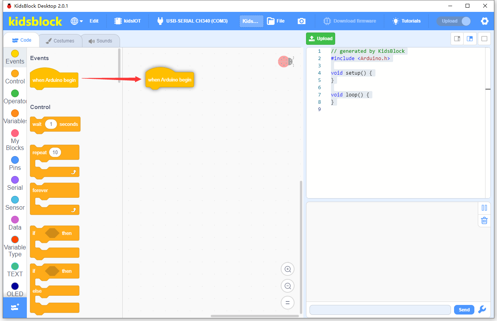

After building your blocks, save it to your computer: **File --> Save to your computer**

Click  to upload the code.

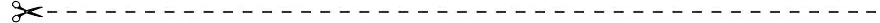

**Method ②**: Load code from your computer.

Download code in **1. Code** to your computer. For convenience, here we save it to D:\Code\2.Code_kidsIOT.

**File --> Load from your computer** and choose code to open.

After loading code, connect to the corresponding port.

After that, click  to upload code.

**Main Interface**

---

## 3.  Modules

Please move the codes to a convenient path as your needs, for instance, path: **D:\Code\2.Code_kidsIOT**.

### KidsIOT Ports View

During experiments, modules can only be connected to ports in the same color.

### 3.1 White LED Module

**LED (Light-Emitting Diode)**

LED is a commonly used light emitting device that converts electrical energy into light energy. Usually, it is used as an indicator in circuits and instruments, or as part of texts or numeric display.

It generally includes gallium(Ga), arsenic(As), phosphorus(P), nitrogen(N) and so on. 

|     LED components      | Emitting light colors |
| :---------------------: | :-------------------: |
| gallium arsenide diode  |          red          |
| gallium phosphide diode |         green         |
|  silicon carbide diode  |        yellow         |
|  gallium nitride diode  |         blue          |

#### Parameters

Operating voltage: DC 3.3 ~ 5 V

Operating current: 1.5 mA (Peak: 2.3mA)

Maximum power: 0.07 W

Control signal: digital signal

Dimensions: 24 x 48 x 18 mm (without housing)

Positioning holes: diameter of 4.8 mm

Interface: telephone socket

#### Principle

Modules with blue housing are digital ones, so we should connect to digital io pins of the mainboard (ports with blue)

In this experiment, we connect the white LED module to port 1. According to the board ports view, the digital io pin at port 1 is io13.

When we set the pin to high(1), the LED lights up in white; if we set to low(0), it will be off.

#### Wiring Diagram

#### Test Code

Open KidsBlock and connect to the board, click File --> Load from your computer.

Choose D:\Code\2.Code_kidsIOT to open **3.1Light_on.sb3**

Click  to connect to COM port and then .

#### Explanation

**Code Blocks**

|            Blocks             |          Code block           |
| :---------------------------: | :---------------------------: |
|    |      |
|              |  |
|              |    |
|  |  |
|  |        |

**Conceive**

1. **Initialization**

   Set pin mode.

   

    

   **Build blocks:**

   ① Drag  and  to the editing area.

   ② Click the triangle to choose pin IO13.

   

   ③ Modify the mode into output .
   
   Three pin mode:
   
   - input
   - output
   - input-pull up
   
   
   
   Q: Why output?
   
   A ：The code is written for the mainboard. For the board, pin io13 is outputting power levels (high or low) to the connected module.
   
   

2. **Main Code**

   Loop: LED lights on for 1s and goes off for 1s, in a loop.

   

    

   **Build blocks:**

   ① Drag . This is a loop code, in which codes will run forever.

   ② Drag  into "forever".

   There are two power level to output: 

   - high
   - low
   
   Choose pin to IO13 and output high.
   
   ③ Drag  into  "forever". This is a delay code.
   
   
   
   Q: Why delay?
   
   A: If you output a high level to LED, it will be always on. Yet, we add a delay of 1s, so it lights up for only 1s. Delay time is the ON/OFF time of LED.
   
   
   
   Pin IO13 outputs high for 1:
   
   
   
   ④ Right-click the code and choose "Duplicate".
   
   
   
   As follows:
   
   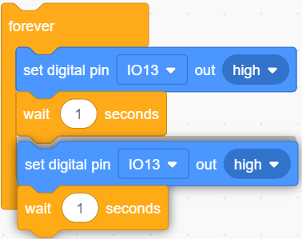
   
   Set the output to low. Pin IO13 outputs low for 1.
   
   
   
   LED will lights on for 1s and goes off for 1s, in a loop.

#### Test Result

After uploading code, the LED module will flash with an interval of 1s (on for 1s and off for 1s).

---

### 3.2  3V Relay Module

Relay module is seen as an automatic switch which controls large current via small one. In circuits, it plays the role of automatic regulator, safety protector and converter.

#### Parameters

Driving voltage: DC 3.3 ~ 5V 

Driving current: 75 mA(5V) ~ 125 mA(3.3V)

Contact capacity: 250 VAC/3A, 30 VDC/3A

Rated power dissipation: 0.15 W

Input signal: digital signal

Shock current: less than 3 A

Operating temperature: -10°C ~ +50°C

Control signal: digital signal

Dimensions: 24 x 48 x 18 mm (without housing)

Positioning hole: diameter of 4.8 mm

Interface: telephone socket

#### Principle

Internal structure:

The coil inside the relay is wound around the iron core to form an electromagnet, which generates electromagnetic force after powering on. 

A relay usually contains a moving contact and two static contacts.

When there is no current in the coil, the electromagnet is not magnetic and is not attractive to the armature, so the moving contact B is in contact with the static contact A. Therefore, A now becomes the normally closed contact (NC). And the moving contact B is also called the common contact (COM).

NC (normally-close): The coil is closed without power.

When a current flows through the coil, the electromagnet is magnetic so that it will attract the armature. At this time, B and the static contact C will be connected. Static contact C is called normally open contact (NO).

NO (normal open): The coil is opened without power.

The 3V relay module is also a digital device so it need to be connected to digital io pins of the board.

In this experiment, we connect the module to port 2, which is pin io2. When we set the pin to high(1), the relay will work; if we set it to low(0), the relay will out of work.

#### Wiring Diagram

#### Test Code

Open KidsBlock and connect to the board, click File --> Load from your computer.

Choose D:\Code\2.Code_kidsIOT to open **3.2Relay.sb3**.

Click  to connect to COM port and click .

#### Explanation

**Code Blocks**

|            Blocks             |          Code block           |
| :---------------------------: | :---------------------------: |
|    |      |
|              |  |
|              |    |
|  |  |
|  |        |

**Conceive:**

Code framework in this section is same as the last one.

1. **Initialization**

   Set pin mode.

   

2. **Main Code**

   Loop: pin io2 outputs high for 1s to the relay module so then the module is conducted. Immediately, the pin outputs low for 1s to the relay and it turns off.

   

####  Test Result

After uploading code, the relay will work and stop working with an interval of 1s. 

When the relay is conducted, B and C is connected and you will hear a tick-tack, and the red LED on the module will light up. When the relay is opened, A and B is connected with also a tick-tack, and the on-board LED goes off.

---

### 3.3 Button Module

Button module mainly integrates a touch switch and a yellow button cap. In the previous sections, we have learned how to output power levels. Herein, we will introduce you how to read power levels by programming. 

#### Parameters

Operating voltage: DC 3.3 ~ 5V 

Operating current: 1.1 mA

Maximum power: 0.0055 W

Operating temperature: -10°C ~ +50°C

Control signal: digital signal

Dimensions: 24 x 48 x 18 mm (without housing)

Positioning hole: diameter of 4.8 mm

Interface: telephone socket

#### Principle

Button is a digital module so it should be connected to digital io pins on the board.

We connect the module to port 3 which is digital pin io26. When the button is pressed, the io pin outputs low; when the button is released, the pin outputs high.

#### Wiring Diagram

#### Test Code

Open KidsBlock and connect to the board, click File --> Load from your computer.

Choose D:\Code\2.Code_kidsIOT to open **3.3Button.sb3**

Click  to connect to COM port and then .

#### Explanation

**Code Blocks**

|              Blocks               |              Code block               |
| :-------------------------------: | :-----------------------------------: |
|        |              |
|                  |          |
|                  |  |
|        |  |
|        |  |
|  |                      |
|      |          |
|      |            |
|      |                |

**Conceive:**

1. **Initialization**

   Set pin mode and initialize the serial port.

   

    

   **Build blocks:**

   ① Move  and  to editing area and set pin to IO26 and mode to input.

   ② Place  under the last code block and set the baud rate to 115200.

2. **Main code**

   Loop: If the digital level output by the module is low(0), the serial monitor will display *The button is pressed !* If it is high(1), the monitor will show *The button is not pressed !*

   

    

   **Conceive:**

   ① 

   ② Place  in "forever". This block determines whether the condition after "if" is true. If yes, run "then"; If not, run "else".

   ③ Put  in the condition. If the values equal each other, the condition is TRUE.

    

   

   ④ Place  into  and set the pin to IO26; modify the number in  to 0.

   As follows:

    

   

   ⑤ Drag  into "if" and print *The button is pressed !* Drag  into "else" and print *The button is not pressed !*

    

   

   The program will determine whether the value read by pin IO26 is 0.
   
   - If yes, print *The button is pressed !* 
   - If not, print *The button is not pressed !* 
   
   ⑥ Drag  in "forever" and set delay to 0.1s. It controls the printing duration. Serial prints fast, so we add delay to better observe the results.
   

#### Test Result

Before uploading code, set baud rate first to avoid garbled words.

Click  and set Buadrate to 115200.

Upload code and press the button, and the serial monitor will show **The button is pressed!**. When you release the button, it prints **The button is not pressed !**

---

### 3.4 Active Buzzer

Buzzer is an electronic sound device with integrated structure. It is powered by DC voltage and is widely used in computer, printer, copier, alarm, electronic toys, automotive electronic equipment, telephone and timer. 

According to the drive mode, it can be divided into active buzzer (internal drive circuits) and passive buzzer (external driver). The difference of the two types is the presence or absence of excitation source.

Active buzzer includes an internal vibration source, so can be triggered to make sound with a fixed frequency. It can be controlled through simple program but with high sound pressure.

However, passive buzzer excludes a vibration source. If the direct current signal is transmitted to a passive buzzer, it will not work. Generally, we drive through square waves with different frequency to achieve different sound effects.

**To sum up, The active buzzer contains a vibration source, and its sound frequency is fixed. Yet there is no vibration source inside the passive one, so it must be driven by square waves whose frequency can be changed to control sounds.**

#### Parameters

Operating voltage: DC 3.3 ~ 5V 

Operating current: 22.5 mA

Maximum power: 0.12 W

Frequency: 2300 Hz

Operating temperature: -10°C ~ +50°C

Input signal: digital signal

Dimensions: 24 x 48 x 18 mm (without housing)

Positioning hole: diameter of 4.8 mm

Interface: telephone socket

#### Principle

Active buzzer is a digital module so it should be connected to digital io pins on the board.

We connect the module to port 4 which is digital pin io27. When the io pin outputs high(1), the buzzer emits sound; when the pin outputs low(0), the buzzer stops alarming.

#### Wiring Diagram

#### Test Code

Open KidsBlock and connect to the board, click File --> Load from your computer.

Choose D:\Code\2.Code_kidsIOT to open **3.4Active_buzzer.sb3**

Click  to connect to COM port and click .

#### Explanation

**Code block**

|            Blocks             |          Code block           |
| :---------------------------: | :---------------------------: |
|    |      |
|              |  |
|              |    |
|  |  |
|  |        |

**Conceive:**

Codes in this section is same as 3.1.

1. **Initialization**

   set pin mode.

   

2. **Main Code**

   Loop: pin io27 outputs high for 1 to make the buzzer emit sound, and then it output low for 1s to stop the buzzer to alarming.

   

#### Test Result

After uploading code, the buzzer will alarm and stop alarming with an interval of 1s. 

---

### 3.5 Obstacle Avoidance Sensor

There are many types of infrared obstacle avoidance sensors, but most of them are the same in principle. They consist of a pair of infrared light emitting tube, infrared light receiving tube and sensor circuits. The transmitting tube emits infrared light, and the receiving tube receives infrared light. When the returned infrared light is not received, the signal pin outputs high; when it is received, the pin outputs low.

#### Parameters

Operating voltage: DC 5V 

Operating current: 6.8 mA

Maximum Power: 0.034 W

Maximum detection distance: 173 mm

Operating temperature: -10°C ~ +50°C

Output signal: digital signal

Detection range: 2 ~ 40 cm

Dimensions: 24 x 48 x 18 mm (without housing)

Positioning hole: diameter of 4.8 mm

Interface: telephone socket

#### Principle

Infrared transmitter TX emits infrared signals with a certain frequency, and the infrared signal will gradually decay with the increase of transmission distance. If they encountered obstacles, they will reflect. 

When the signal reflected back by the receiving tube RX is weak, the pin outputs a high level, indicating that the obstacle is far away.

When the reflected signal is relatively strong, the pin outputs low, indicating that the obstacle is relatively close, and the indicator is on. 

We can adjust the effective distance via two potentiometers: one adjusts the transmitting power, the other adjusts the receiving frequency.

The obstacle avoidance sensor is a digital module so it should be connected to digital io pins on the board.

We connect the module to port 6 which is digital pin io23. When the sensor detects obstacles, the io pin outputs low. When it detects nothing or the obstacle is far away from the sensor, the pin outputs high.

#### Wiring Diagram

#### Test Code

Open KidsBlock and connect to the board, click File --> Load from your computer.

Choose D:\Code\2.Code_kidsIOT to open **3.5Obstacle_avoidance.sb3**

Click  to choose port and then .

After uploading code, we need to rotate the two potentiometers for calibration. Otherwise the sensor cannot detect correctly.

**NOTE:** When adjusting the sensor, ensure there is no obstacles block it. Otherwise, the detection distance will be inaccurate.

Firstly, adjust the transmitting power, turn the potentiometer clockwise to the end. And then turn it back slowly counterclockwise. 

When the SLED light is on, rotate the potentiometer clockwise till the SLED is just OFF.

Then, adjust the  receiving frequency, turn the potentiometer clockwise to the end. And then turn it back slowly counterclockwise. 

When the SLED light is on, rotate the potentiometer clockwise till the SLED is just OFF. At this time, the detection distance is the farthest.

After adjustment, now it's ready to use!

#### Explanation

**Code Blocks**

|              Blocks               |              Code block               |
| :-------------------------------: | :-----------------------------------: |
|        |              |
|                  |          |
|                  |  |
|        |  |
|        |  |
|  |                      |
|      |          |
|      |            |
|      |                |

**Build Codes**

Codes in this section is same as 3.3.

1. **Initialization**

   Set pin mode and baud rate.

   

2. **Main Code**

   Loop: print the digital power level read by pin IO23. If the it outputs 0, the serial monitor will print the value and two space + *Obstruction ahead!* ; If it is 1, the monitor shows the value and two space + *All going well!*. The output results will be refreshed every 0.1s.

   

   

   Q: Why two space?

   If there is no space, the status result will be close to "*Obstruction ahead!*", as follows:

   

   With space:

   

   A: To separately print power level value and statement.

   

#### Test Result

Before uploading code, set baud rate first to avoid garbled words.

Click  to set Buadrate to 115200.

After uploading code, when the sensor detects obstacles, the sensor outputs low and the status value is 0, the SLED lights up, and Shell prints *Obstruction ahead!*

When the sensor detects nothing, the sensor outputs high and the value is 1, the SLED goes off, and Shell displays *All going well!*

---

###  3.6 Photoresistor

The sensors we have learned before are all digital modules. For instance, button module: when the button is released, we read a high level (3.3V), and when the it is pressed, we read low (0V). 

However, the voltage between 0 ~ 3.3V cannot be read by the digital IO port. So we adopt analog modules that can read the intermediate voltage value through the ADC analog port on the board.

A photoresistor is an analog sensor, which is mainly composed of a photoresistor element. The resistance changes with the light intensity, so we can take advantage of the sensor to design circuit that converts resistance change to voltage change. 

For applications, the photoresistor is able to simulate people's judgment of the intensity of the ambient light.

#### Parameters

Operating voltage: DC 3.3 ~ 5V 

Current: 0.2 mA

Maximum power: 0.001 W

Operating temperature: -10°C ~ +50°C

Output signal: analog signal

Dimensions: 24 x 48 x 18 mm (without housing)

Positioning hole: diameter of 4.8 mm

Interface: telephone socket

#### Principle

The photoresistor is based on the internal photoelectric effect. The stronger the light is, the lower the resistance will be.

The light intensity changes, and the resistance also changes, and the voltage detected by the analog port also changes (among 0 ~ 3.3V). This voltage change is a continuously analog value(any value within 0 ~ 3.3V).

The board can not directly process analog signals which needs to be converted into digital signals, so the analog value should take an ADC(Analog to Digital Converter) acquisition.

**What is ADC?**

ADC(Analog to Digital Converter) converts analog values to digital ones. The board has integrated ADC acquisition, which can be used directly.

**ADC Technical Parameters**

1. Resolution: 12 bit

	An n-bit ADC means that the ADC has 2ⁿ scales. A 10-bit ADC contains a total of $2^{12}=4096$ scales, which outputs a total of 4096 digits (0~4095) with each scale of $\frac{3.3}{4095}≈0.00081(V)$.

2. General ADC input voltage calculation:

	$ Vin=\frac {AVDD_{ADC}}{2^{Resolution Bits}-1}*ReadData$ 

	$AVDD_{ADC}$: Reference voltage

This is an analog module, which need to be connected to the analog io pins (analog port is in red on the board). 

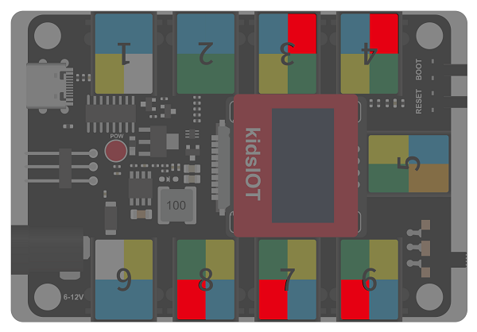

We connect the module to port 7 which is io35. When light shines on the photoresistor, it outputs the converted digital signal value.

#### Wiring Diagram

#### Test Code

Open KidsBlock and connect to the board, click File --> Load from your computer.

Choose D:\Code\2.Code_kidsIOT to open **3.6Photoresistor.sb3**

Click  to connect to port and then .

#### Explanation

**Code Blocks**

|              Blocks               |              Code block               |
| :-------------------------------: | :-----------------------------------: |
|        |              |
|                  |          |
|                  |    |
|        |  |
|        |  |
|  |            |
|  |        |
|      |          |
|      |                |

**Conceive:**

1. **Initialization**

   Set pin mode and baud rate.

   

2. **Main Code**

   Loop: print the analog value and voltage value converted from the analog value which are read by pin IO35. The results will be refreshed every 0.1s.

   

    

   **Build code:**

   ① 

   ② Drag  into "forever" and print *ADC Value:*, and modify to no-warp output.

   ③ Drag  into "forever" and modify to no-warp output. Put  into the print content and set pin to IO35.

    

   

   The serial monitor will print the analog value read by pin IO35.

   ④ Drag  into "forever" and print two space + *Voltage:*, and modify to no-warp output.

    

   

   ⑤ Find . In this operation block, the left value is Numerator and the right one is Denominator.

   Input voltage = read analog value * Voltage value of a single scale

   $\frac {AVDD_{ADC}}{2^{resolution bit}-1}$

   Therefore, we set the left in  to 3.3(input voltage is 3.3V) and right to 1023(board ADC resolution is 12bit, ${2^{12}-1=4095}$)

    

   **Voltage value of a single scale**: 

   ⑥ Find  . In this operation block, the result is equal to the multiplication of two numbers.

   Drag  into the left of , and set pin to IO35. In the right, put Voltage value of a single scale. Then we can get the converted voltage value.

   **The converted input voltage value**:

   ⑦ Drag  into "forever" and print the converted input voltage value.

   The serial monitor prints the analog value and voltage value converted from the analog value which are read by pin IO35:

   

   ⑧ Drag  into "forever" and set delay to 0.1s. It controls the printing duration. Serial prints fast, so we add delay to better observe the results.

#### Test Result

Before uploading code, set baud rate first to avoid garbled words.

Click  and set Buadrate to 115200.

After uploading code, Shell prints the ADC value received by the photoresistor and the converted voltage. The stronger the light is, the larger the ADC and voltage value will be.

---

### 3.7 Potentiometer

Potentiometer is an analog module which mainly consists of rotary resistor, knob and connector. When we rotate the knob, the connector will be linked to different built-in resistors, so that the output resistance/voltage changes.

In circuits, potentiometers are widely used for device adjustment, volume control and frequency control.

#### Parameters

Operating voltage: DC 3.3 ~ 5V 

Operating current: 0.55 mA

Operating power: 0.00275 W

Operating temperature: -10°C ~ +50°C

Output signal: analog signal

Dimensions: 24 x 48 x 28.6 mm (without housing)

Positioning hole: diameter of 4.8 mm

Interface: telephone socket

#### Principle

The potentiometer is an analog module so it should be connected to analog io pins on the board.

We rotate the knob to change resistance, so that the current/voltage changes.

**Resistor**

Resistor is a current-limiting element. Generally, we connect its two pins into the circuit to limit the amount of current passing through it.

Resistance of fixed resistors are constant, while that of variable ones can be changed according to conditions.

Here are some types of resistors.

**Potentiometer**

Potentiometer is a resistance element with three leading terminals, whose resistance can be adjusted according to a certain law. It is usually composed of a resistor and a movable brush, so it belongs to variable resistor.

The principle of the potentiometer: Constant voltage is applied to its terminals (terminal ① and terminal ③), and we rotate the reed to change the output of the resistance.

We connect the module to port 8 which is io34. When we rotate the knob, the digital value converted from resistance will be output.

#### Wiring Diagram

#### Test Code

Open KidsBlock and connect to the board, click File --> Load from your computer.

Choose D:\Code\2.Code_kidsIOT to open **3.7Rotary_potentiometer.sb3**

Click  to connect to port and then .

#### Explanation

**Code Blocks**

|              Blocks               |              Code block               |
| :-------------------------------: | :-----------------------------------: |
|        |              |
|                  |          |
|                  |    |
|        |  |
|        |  |
|  |            |
|  |        |
|      |          |
|      |                |

**Build blocks:**

Codes in this section is same as the last experiment.

1. **Initialization**

   Set pin mode and baud rate.

   

2. **Main Code**

   Loop: print the analog value read by pin IO34 and the converted voltage value. The results will be refreshed every 0.1s.

   

#### Test Result

Before uploading code, set baud rate first to avoid garbled words.

Click  and set Buadrate to 115200.

After uploading code, rotate the potentiometer, and the serial monitor prints the current ADC value and the converted voltage value.

---

### 3.8 Joystick	

This module adopts PS2 joystick potentiometer, which includes (X, Y) axis analog output, (Z) axis button digital output. These X, Y, Z values may achieve specific functions.

#### Parameters

Operating voltage: DC 3.3 ~ 5V 

Current: 12 mA

Maximum power: 0.06 W

Operating temperature:-10°C ~ +50°C

Dimensions: 24 x 48 x 33.4 mm (without housing)

Positioning hole: diameter of 4.8 mm

Interface: telephone socket

#### Principle

**I2C Interface**

I2C/IIC/I2C bus (Inter-Integrated Circuit) is a two-wire serial bus developed by PHILIPS for MCU, which is suitable for the interface connection between MCU and peripheral devices.

IIC communicates over two lines: Clock channel (SCL) and Data Channel (SDA).

Both terminals must be connected to kidsIOT's specific pins: SCL is connected to pin io22; SDA is connected to pin io21.

IIC module(in green housing) needs to connect it to IIC ports. All digital IIC ports are with green sticker on the board.

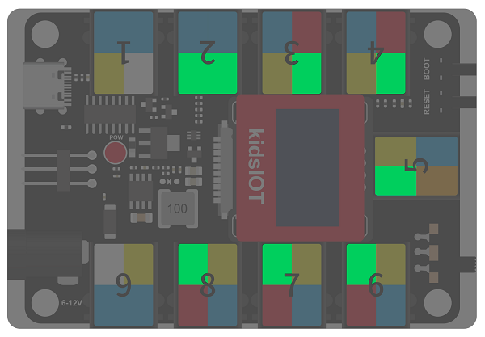

We need to import ROCKER library first, so then the values of the X, Y, and Z axes can be read.

#### Wiring Diagram

#### Test Code

Open KidsBlock and connect to the board, click File --> Load from your computer.

Choose D:\Code\2.Code_kidsIOT to open **3.8Rocker.sb3**

Click  to connect to port and click .

#### Explanation

**Code Blocks**

|            Blocks             |              Code block               |
| :---------------------------: | :-----------------------------------: |
|    |              |
|    |  |
|    |  |
|            |            |
|  |          |
|  |                |

**Build blocks:**

Codes in this section is same as the last experiment.

1. **Initialization**

   Set pin mode and baud rate.
   
   

2. **Main Code**

   Loop: print values in x, y, z axes every 0.1s.

   
   
    
   
   **Build blocks:**
   
   ① Enter  and choose **Sensor**, add joystick module.
   
   
   
   After being loaded. click Back.
   
   
   
   And you will see the joystick module.
   
   
   
   ② 
   
   ③ Add six  blocks and three  blocks into "forever":
   
   
   
   There are two spaces before “Y：” and “B：” to separate values and statements to facilitate viewing of printed values.
   
   ④ Drag  into "forever" and set delay to 0.1. It controls the printing duration. Serial prints fast, so we add delay to better observe the results.
   

#### Test Result

Before uploading code, set baud rate first to avoid garbled words.

Click  to set Buadrate to 115200.

After uploading code, the serial monitor displays the values in X, Y, Z axis. 

Value on X-axis increases from 0 to 1023 in the direction of the arrow. Value on Y-axis increases from 0 to 1023 in the direction of the arrow. Press the joystick and the value on z-axis is 1; release it and the value on z-axis is 0.

---

### 3.9 SC7A20 3-Axis Acceleration Sensor

This sensor is used to measure the acceleration of an object in three axes (X, Y and Z). It features small size and light weight, and can fully and accurately reflect the motion properties of the object. In application, it is widely used in aerospace, robotics, automotive and medical fields.

SC7A20 is a high-precision 12-bit digital three-axis acceleration sensor chip with multiple functions, low power consumption, small size and accurate measurement.

#### Parameters

Operating voltage: DC 3.3 ~ 5V 

Operating current: 30 uA

Operating power: 0.000015 W

Operating temperature: -10°C ~ +50°C

Output signal: analog signal

Dimensions: 24 x 48 x 18 mm (without housing)

Positioning hole: diameter of 4.8 mm

Interface: telephone socket

#### Principle

The sensor measures spatial acceleration(the speed of the object in space). The three-axis acceleration is mainly to decompose in X, Y, and Z three axes.

Acceleration sensor is mainly divided into piezoelectric, capacitive and thermal response. 

According to the number of input axes, there are single axis, two axis and three axis accelerometers. 

According to the different output signals, there are analog and digital(the analog output value is voltage, digital output value is digital signal). Analog sensors also need to add digital-to-analog converter (ADC), but the analog one has integrated ADC circuit, so can be directly transmit data through the communication interface(SPI, I2C, etc.).

The SC7A20 acceleration sensor is also an IIC module so needs to be connected to IIC port.

We need to import the SC7A20 library to read the acceleration values on the X, Y and Z axes.

#### Wiring Diagram

#### Test Code

Open KidsBlock and connect to the board, click File --> Load from your computer.

Choose D:\Code\2.Code_kidsIOT to open **3.9Triaxial_acceleration.sb3**

Click  to connect to port and then  the code.

#### Explanation

**Code Blocks**

|            Blocks             |              Code block               |
| :---------------------------: | :-----------------------------------: |
|    |              |
|    |  |
|    |  |
|    |    |
|  |          |
|  |                |

**Conceive:**

Codes in this section is same as the last experiment.

1. **Initialization**

   Set pin mode and baud rate.

   

2. **Main Code**

   循环执行：每0.1秒刷新打印一次X轴、Y轴、Z轴的值。

   

    

   **Build blocks:**

   ① Click  to select **Sensor** and add the acceleration sensor.

   

   Click Back.

   

   And you will see the module is loaded:

   

   ② 

   ③ Drag six  blocks and three  blocks in "forever" as follows:

   

   Note there are two space before “Y：” and “B：” for better viewing.

   ④ Add a  and set delay to 0.1. It controls the printing duration. Serial prints fast, so we add delay to better observe the results.

#### Test Result

Before uploading code, set baud rate first to avoid garbled words.

Click  to set Buadrate to 115200.

After uploading code, shake the SC7A20 acceleration sensor, and the Shell prints the acceleration sensor on X, Y, Z axis.

---

### 3.10 Servo

Generally, servo exports three wires in three colors: brown, red and orange. Brown is the grounded, red is the positive, and orange is signal. The wire colors may vary from brands.

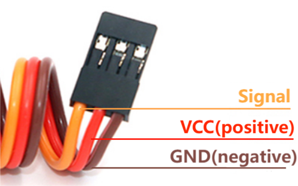

#### Parameters

Operating voltage: DC 3.3 ~ 5V 

Rated voltage: 4.8V

Rated current: 200 mA

Angular speed: 60°/0.12s

Operating temperature: -10°C ~ +50°C

Length: Five Lego hole units 8x5 = 40 mm

Width: Two Lego width units 8x2 = 16 mm

Height: Three Lego height units 3.2x3 = 9.6 mm

Base hole position: diameter of 4.8

Interface: 3pin interface with a spacing of 2.54 mm

#### Principle

Servo is a kind of motor generally controlled by PWM (pulse width modulation). Herein, this 270°(-45°  ~ 225°) servo is compatible with LEGO.

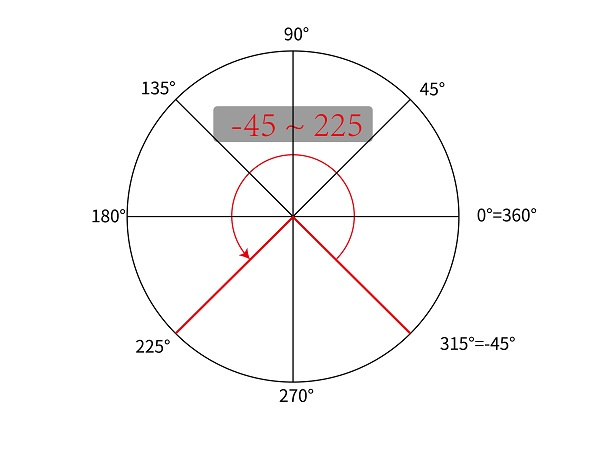

Rotation range of 270° servo: -45° ~ 225°, which is 270° in total, rather than rotating to 270°.

Before using it, we need to import library first.

#### Wiring Diagram

The connection terminal of 270° servo is a 3-pin headers with a 2.54mm pitch, which needs to be connected to the pin interfaces. 

We connect servo to io33.

#### Test Code

Open KidsBlock and connect to the board, click File --> Load from your computer.

Choose D:\Code\2.Code_kidsIOT to open **3.10Servo.sb3**

Click  to connect to the port and  the code.

#### Explanation

**Code Blocks**

|             Blocks              |            Code block             |
| :-----------------------------: | :-------------------------------: |
|      |          |
|  |  |
|    |      |
|    |            |

**Conceive:**

**Main Code**

Click  to add library **Servo 270** first.

Loop: servo rotates to -45°, 45°, 135°, 225° in order with a stop of 1s for each rotation.

NOTE: 270° servo rotation range: -45° ~ 225°(270° in total), rather than 270°.

**Build blocks:**

① 

② Drag  into "forever" and set pin to IO33, channel to CH5(LT2), and output to -45.

③ Add  and set the delay to 0.1s. 

④ **Duplicate** the block:

As follows:

Duplicate 3 times in total. Set the output angle value to 45, 135, 225 respectively.

#### Test Result

After uploading code, servo rotates to -45° and stop 1s; then it rotates to 45° and stop 1s; then it rotates to 135° and stop 1s; at last it rotates to 225° and stop 1s. 

After these steps, it will back to -45°, in a circulation.

---

## 4. Comprehension

### 4.1 Manual Lighting

In this experiment, we will apply both LED module and button module to form a lighting device.

#### Flow

#### Assembly

**Required:**

**Step 1**

**Step 2**

**Step 3**

**Step 4**

**Step 5**

**Step 6**

**Step 7**

**Step 8**

**Completed!**

#### Wiring Diagram

#### Test Code

Open KidsBlock and connect to the board, click File --> Load from your computer.

Choose D:\Code\2.Code_kidsIOT to open **4.1Manual_lighting.sb3**

Click  to connect to port and then .

#### Explanation

**Code Blocks**

|              Blocks               |             Code block              |
| :-------------------------------: | :---------------------------------: |
|        |            |
|                  |        |
|                  |          |
|                  |  |
|  |                    |
|      |        |
|      |          |

**Conceive:**		

1. **Initialization**

   Set the pins of white LED module and button module, initialize the serial monitor.

   

2. **Main Code**

   Loop: Determine whether the button is pressed. If it is, the button outputs 0. If not, the button outputs 1.

   - Press the button (pin IO26 reads value 0), and LED will light up (pin IO23 outputs 1 to LED module).
   - Release the button (pin IO26 reads value 1), and LED will go off (pin IO23 outputs 0 to LED module).
   
   
   

#### Test Result

After uploading code, press the button, and LED lights up. When you release the button, LED is off.

---

### 4.2 Automatic Lighting

Herein, we combine the photoresistor and LED module to design an automatic lighting system.

#### Flow

#### Assembly

**Required:**

**Step 1**

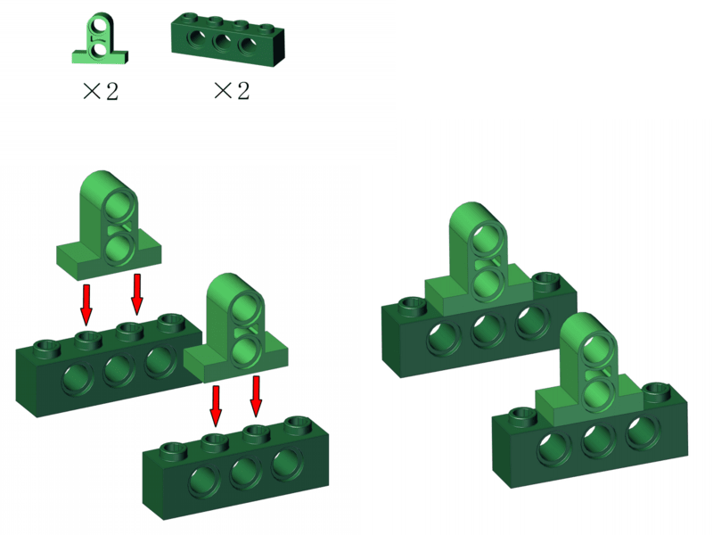

**Step 2**

**Step 3**

**Step 4**

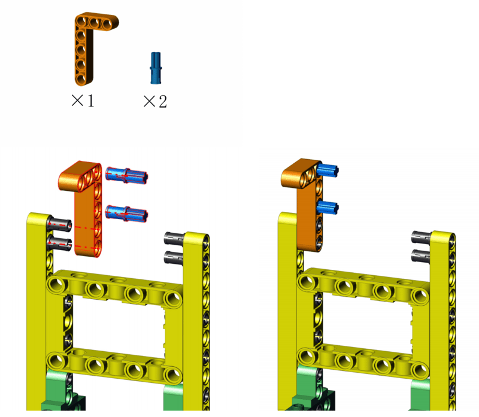

**Step 5**

**Step 6**

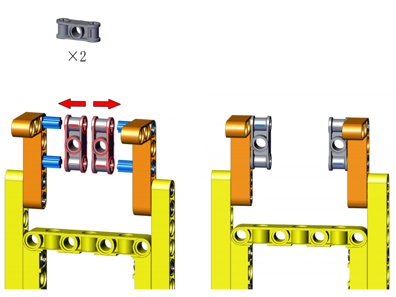

**Step 7**

**Step 8**

**Step 9**

**Completed!**

#### Wiring Diagram

#### Test Code

Open KidsBlock and connect to the board, click File --> Load from your computer.

Choose D:\Code\2.Code_kidsIOT to open **4.2Automatic_lighting.sb3**

Click  to connect to the port and then .

#### Explanation

**Code Blocks**

|              Blocks               |              Code block               |
| :-------------------------------: | :-----------------------------------: |
|        |              |
|                  |          |
|                  |    |
|                  |            |
|        |  |
|        |  |
|  |      |
|      |          |
|      |            |
|      |                |

**Conceive:**		

1. **Initialization**

   Set the pins of white LED module and the photoresistor; Initialize the serial monitor.

   

2. **Main Code**

   Loop:

   ① Print the value read by the photoresistor.

   ② Determine whether the photoresistor value is less than 1000 every 0.1s.

   - value < 1000 (weak light): LED lights up.
   - value ≥ 1000 (adequate light): LED goes off.

   

#### Test Result

Upload code and the photoresistor starts to detect the ambient light intensity.

In room, when the light is sufficient (the value is greater than 1000), the LED is off.

When the ambient light is weak (the value is less than 1000), the LED is on. 

In the code, the threshold value 1000 can be modified according to your needs.

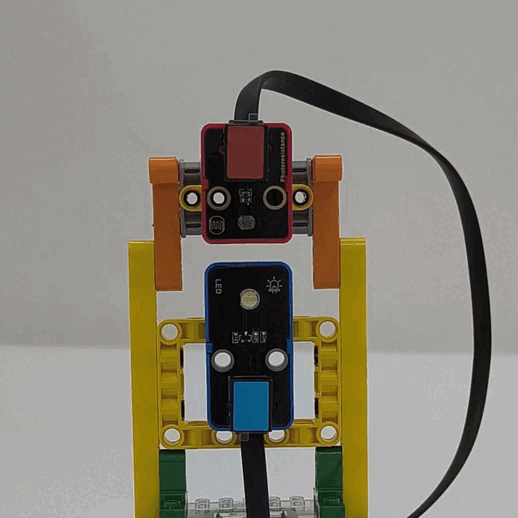

---

### 4.3 Light Adjustment

In this experiment, we will introduce how to adjust the brightness of LED module via a potentiometer.

#### Flow

#### Assembly

**Required:**

**Step 1**

**Step 2**

**Step 3**

**Step 4**

**Step 5**

**Step 6**

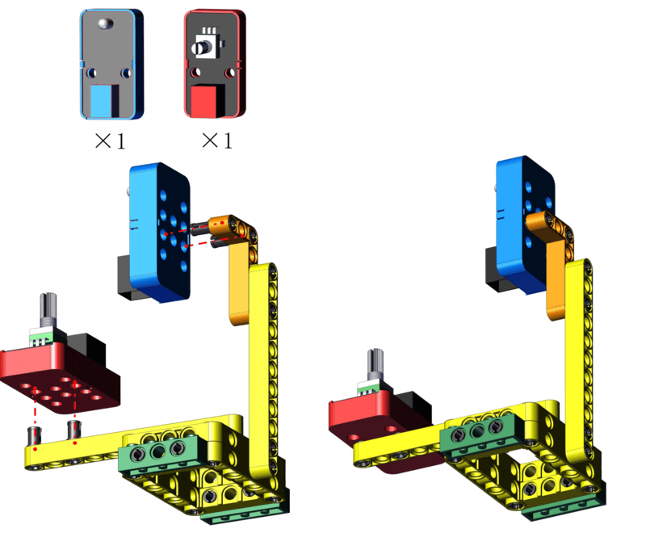

**Step 7**

**Completed!**

#### Wiring Diagram

#### Test Code

Open KidsBlock and connect to the board, click File --> Load from your computer.

Choose D:\Code\2.Code_kidsIOT to open **4.3Brightness_adjustment.sb3**

Click  to connect to port and then click .

#### Explanation

**Code Blocks**

|            Blocks             |             Code block              |
| :---------------------------: | :---------------------------------: |
|    |            |
|              |        |
|              |          |
|              |  |
|  |        |
|        |                |

**Conceive:**		

1. **Initialization**

   Set the pin of the white LED and the potentiometer module, initialize the serial monitor.

   

2. **Main Code**

   Loop: Read the value output by the potentiometer, and set the value as the duty cycle of the LED module to control its brightness.

   

    

   **Build blocks:**

   ① 

   ② Put  into "forever" and set pin to IO3.

   ③ Add a  (map block).

   

   

   

   Q ： The brightness value of LED is 0 ~ 255, while the output analog value of potentiometer is 0 ~ 4095. So how to control the brightness via the potentiometer?

   A ： We use map block to map the output range to the brightness range.

    

   Q ： What is MAP?

   A ： In mathematics, MAP is the term for a relationship between two sets of elements that "correspond" to each other.

   Set: a whole consisting of one or more defined elements.

   There is a correspondence between Set A and B. For every Element a in Set A, there is always a unique element b corresponding to it in Set B, which is called map A to B.

   The concept of mapping is not only used in mathematics, but in computer science. In a computer program, mapping is a way to map each element in one set to a unique element in another.

   We assume that the output analog values of the potentiometer is A, and the brightness range is B. We  map values in A to B, so the output value will correspond to a unique brightness value. This kind of one-to-one mapping enables the potentiometer to directly adjust the brightness.

   

   

   Five values need to be set in this map block: 

   ​	(1): the value to be mapped;

   ​	(2 & 3): the range of the value to be mapped;

   ​	(4 & 5): the range after mapping.

   Set the mapped value as the analog value read by IO34: Drag  to the first box and set pin to IO34.

   

    

   Set the range of the value to be mapped: here is the output range of the potentiometer(0 ~ 4095), so we set the second and third value to 0 and 4095 respectively.

   

    
   
   Set the range after mapping: here is the brightness value range of LED(0 ~ 255), so we set the forth and fifth value to 0 and 255 respectively.
   
   
   
   ④ Put the map block into the PWM output as the duty cycle of the white LED module, so that we can control the brightness via the potentiometer.
   
   

#### Test Result

Upload code and rotate the potentiometer, and the LED brightness will change accordingly. The greater the ADC is, the brighter the LED will be.

---

### 4.4 Smart Trash Can (Manual Mode)

In this project, we use a joystick and a servo to control the trash can lid.

#### Flow

#### Assembly

**Required:**

**Step 1**

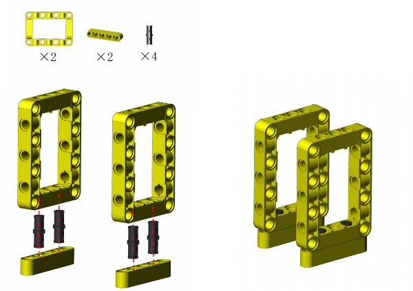

**Step 2**

**Step 3**

**Step 4**

① Hold the lid still to make it align with the hole.

② Insert the rod.

ATTENTION: Keep the lid flatwise.

**Step 5**

**Step 6**

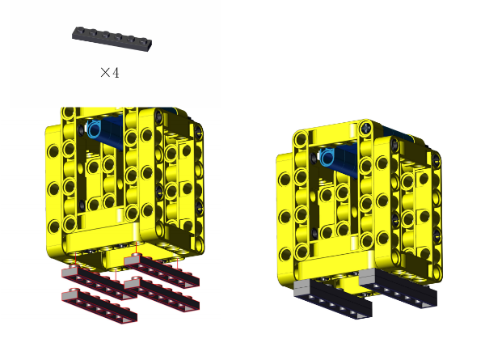

**Step 7**

**Step 8**

**Step 9**

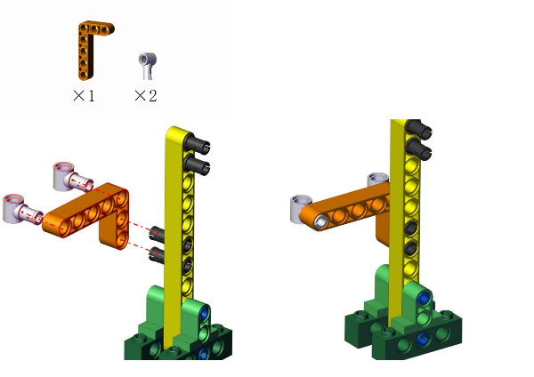

**Step 10**

The servo need to be calibrated before using. Connect the servo to pin io33 on the board and link the board to computer via USB cable.

Open KidsBlock and click File --> Load from your computer.

Open D:\Code\2.Code_kidsIOT and choose **Servo_Calibration.sb3**.

Click  to connect to the port and then .

After calibration, disconnect the board to computer and continue to mount.

ATTENTION: During mounting, please hold and keep the lid flatwise.

**Step 11**

**Step 12**

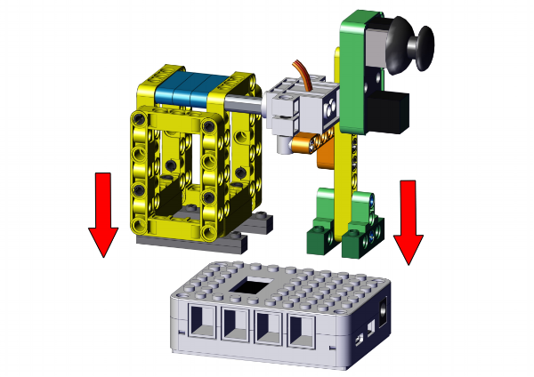

**Completed!**

#### Wiring Diagram

#### Test Code

Open KidsBlock and connect to the board, click File --> Load from your computer.

Choose D:\Code\2.Code_kidsIOT to open **4.4Smart bin_Manual mode.sb3**

Click  to connect to the port and then  the code.

#### Explanation

**Code Blocks**

|              Blocks               |              Code block               |
| :-------------------------------: | :-----------------------------------: |
|        |              |
|    |      |
|                |            |
|        |  |
|        |  |
|  |      |
|      |          |
|      |            |
|      |                |

**Conceive:**		

1. **Initialization**

   Set the servo pin and baud rate.

   

2. **Main Code**

   Loop: read the value of joystick in y-axis and refresh it every 0.1 seconds, and print it on serial monitor.

   If the value in y-axis is less than 490, set the servo to 45°. If not, set the servo to 180° so then the lid will be closed.

   

    
   
   **Conceive:**
   
   ① Build blocks as follows: Read the value of joystick in y-axis and refresh it every 0.1 seconds.
   
   
   
   ② Put the following code blocks in "forever".
   
   
   
   Determine whether the value in y-axis is less than 490.
   
   - If yes: set the servo to 45° to open the lid.
   - If not: set the servo to 180° to close the lid.

#### Test Result

Upload code and push the joystick as follows, and the lid will open. If you release the joystick, the lid will close. Now you can control the trash can manually!

---

### 4.5 Smart Trash Can (Automatic Mode)

We will construct an automatic trash can with obstacle avoidance sensor, active buzzer and servo.

#### Flow

#### Assembly

**Required:**

Step 1 to 10 are the same as those in 4.4, so you can directly use the form in 4.4 here.

① Remove the joystick.

② mount from step 11.

Yet if you have not assemble the building blocks in 4.4, please start from step 1.

**Step 1**

**Step 2**

**Step 3**

**Step 4**

① Hold with your fingers.

② Insert the rod. 

ATTENTION: keep the lid flatwise.

**Step 5**

**Step 6**

**Step 7**

**Step 8**

**Step 9**

**Step 10**

The servo need to be calibrated before using. Connect the servo to pin io33 on the board and link the board to computer via USB cable.

Open KidsBlock and connect to the board, click File --> Load from your computer.

Choose D:\Code\2.Code_kidsIOT to open **Servo_Calibration.sb3**

Click  to connect to port and  the code.

After calibration, disconnect the board to computer and continue to mount.

ATTENTION: During mounting, please hold and keep the lid flatwise.

**Step 11**

**Step 12**

**Step 13**

**Step 14**

**Completed!**

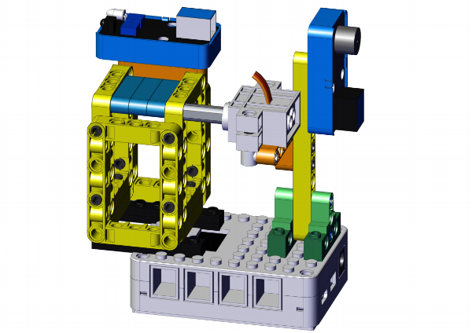

#### Wiring Diagram

#### Test Code

Open KidsBlock and connect to the board, click File --> Load from your computer.

Choose D:\Code\2.Code_kidsIOT to open **4.5Smart bin_Automatic mode.sb3**

Click  to connect to port and then .

#### Explanation

**Code Blocks**

|              Blocks               |              Code block               |
| :-------------------------------: | :-----------------------------------: |
|        |              |
|                  |          |
|                  |  |
|                  |            |
|    |      |
|  |                      |
|      |          |
|      |            |
|      |                |

**Conceive:**		

1. **Initialization**

   Set the pins of obstacle avoidance sensor, buzzer and servo.

   

2. **Main Code**

   Loop: Determine whether the read value equals 0.

   - If it is 0, i.e., the sensor detects obstacles, the buzzer will receive a high level so then emit sound. At this time, the servo rotates to 45° to open the lid.
   - If it is not 0, i.e., the sensor detects nothing, the buzzer will not alarm. At this time, the servo rotates to 180° to close the lid.

   

   

   Q ： Function of the DELAY block?

   When the obstacle is leaving the sensing range, the lid will immediately close without delay. Thus, we add a delay time to maintain the state of the lid.

   A ： Delay is used to maintain the state of the lid, which can be modified according to your needs.

   

#### Test Result

After uploading code, we first need to adjust the obstacle avoidance sensor (please see chapter 3.5 for details).

After adjusting, place something in the sensing range in front of the obstacle avoidance sensor.

When the obstacle avoidance sensor detects it, the buzzer makes a sound, and the servo rotates to open the lid; When the thing leaves the sensing range, the sensor detects nothing, and the buzzer stops alarming, and the servo rotates to close the lid.

---

### 4.6 Smart Trash Can (Drop Alarm)

In this experiment, we will add a drop alarm system to the trash can with an SC7A20TR three-axis acceleration sensor and an active buzzer.

#### Flow

#### Assembly

**Required:**

The block appearance is similar to that in chapter 4.4 and 4.5. If you've already built one of them, you don't have to dismantle it all and reassemble it, just follow these steps.

**The blocks in 4.4:**

① Remove the servo and the lid

② Assemble from step 4

**The blocks in 4.5**

① Remove the servo and the lid

② Assemble from step 5

Yet if you have not assemble the building blocks, please start from step 1.

**Step 1**

**Step 2**

**Step 3**

**Step 4**

**Step 5**

**Step 6**

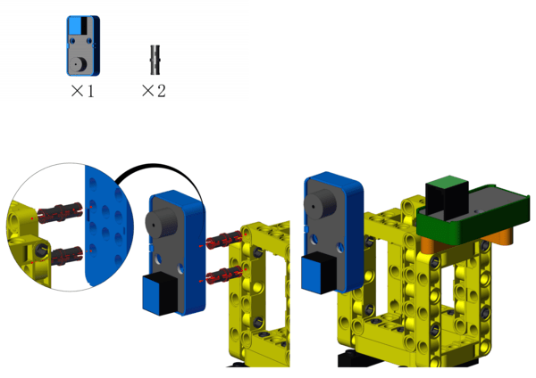

**Step 7**

**Completed!**

#### Wiring Diagram

#### Test Code

Open KidsBlock and connect to the board, click File --> Load from your computer.

Choose D:\Code\2.Code_kidsIOT to open **4.6Smart bin_Drop alarm.sb3**

Click  to connect to port and then .

#### Explanation

**Code Blocks**

|              Blocks               |              Code block               |
| :-------------------------------: | :-----------------------------------: |
|        |              |
|                  |          |
|                  |            |
|        |  |
|  |                      |
|        |            |
|      |          |
|      |            |
|      |                |

**Build blocks:**

1. **Initialization**

	Set pin mode and initialize the serial port.

	

2. **Main Code**

	Loop: determine whether there is a fall, and print the result on serial monitor.

	

	 is a fall detection code block. When the SC7A20 acceleration sensor is detected in a non-horizontal position (fall), the output value is 1; When the sensor is detected in a horizontal position (none falling), the output value is 0.

#### Test Result

Place the trash can flatwise.

Upload code and tilt the trash can, the buzzer will alarm.

Straighten it, and the buzzer stops alarming.

