# Binsite for Kidspico


## 1. Code and Firmware

[DOWNLOAD](../Code.zip)

Download and unzip these files. Here all codes are in folder **3.Code_kidspico** and firmware is at **3.Firmware_kidspico** 

For convenience, <span style="color: rgb(2550, 10, 50);">we move the codes into: **D:\Code\3.Code_kidspico**.</span> You can also choose to move it into any disks at will. 

---


## 2. Development Environment Configuration

### 2.1 Thonny Download

#### Windows

**We demonstrate on Windows 10.**

Download: [Thonny official](https://thonny.org)

Click **Windows** to choose one version to download.


#### MAC

Similar to Windows.


### 2.2 Thonny Installation

Two methods:

- Install Thonny+Python package

  Recommended for beginners: When you install, the Python environment and Thonny will be packaged so both installed. There are also two ways to install the package:

  - Installer

    

  - Portable variant

    

- Install Thonny only

  Recommended for developers: When the user already has a python environment, `pip install thonny` comes in handy to install Thonny separately.

  

Please just install according to your needs.

#### Installer

Here we demonstrate how to install `Installer with 64-bit Python 3.10` on <span style="background:#ff0;color:#000">64bit Windows 10</span>.

（1）After downloading, click  . And you will see **Select Setup Install Mode**, choose **Install for me only**.


（2）**Next**.


（3）Tick **I accept the agreement** and **Next**.


（4）The default path is Disk C, or you can click **Browse...** to modify the path. After that, click **Next**.


（5）Choose a path to create the program's shortcuts, and click **Next**.


（6）Tick **Create desktop icon** and click **Next**.


（7）Inatall.


（8）“**Finish**”.


（9）Open Thonny and choose your language.


（10）Main interface:


#### Portable Variant

Here we demonstrate how to install `Portable variant with 64-bit Python 3.10` on <span style="background:#ff0;color:#000">64bit Windows 10</span>.

（1）After downloading and being unzipped, click  to choose your language.


（2）Main interface:


（3）For convenience, please send  to Desktop(create shortcut).

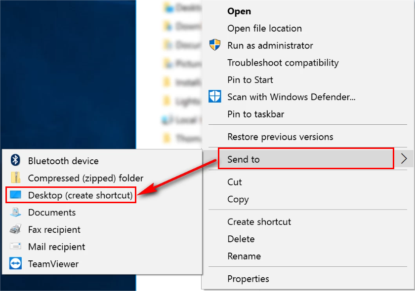

Shortcut: 

---

### 2.3 Firmware

Press and hold the BOOT button on the kidspico mainboard, connect it to PC via USB cable and then release the BOOT button. 

A removable hard disk will show up.

Open folder **3.Firmware_kidspico**, find and copy the firmware into this disk.


After that, open Thonny to connect to port (COM number varies from devices). 


---

### 2.4 Thonny

#### Interface

Click **View** and tick **Files** to open the file path management.


#### Toolbar


|          ICON           |            FUNCTION            |
| :---------------------: | :----------------------------: |
|  |          New (Ctrl+N)          |
|  |        Open... (Ctrl+O)        |
|  |         Save (Ctrl+S)          |
|  |    Run current script (F5)     |
|  |      Debug current script      |
|  |         Step over (F6)         |
|  |         Step into (F7)         |
|  |            Step out            |
|  |          Resume (F8)           |
|  | Stop/Restart backend (Ctrl+F2) |

---

### 2.5 Test

<span style="color: rgb(2550, 10, 50);">Please download and unzip code files and save them in a path as your need. For instance, **D:\Code\3.Code_kidspico**.</span>

In Files, click **This computer**.


Enter **Disk D** and open folder **Code**, find **3.Code_kidspico** and you will see all codes.

  

Choose COM port. 


#### Test Shell Command

Input the following code in Shell.

```python
print('hello world')
```


Press "Enter" and the Shell prints **hello world**.


---

#### Test Online Running

Click to open code **Onboard_LED.py**.


Click  to run the code, and the yellow LED on kidspico board will flashes: on for 1s and off for 1s.


---

#### Test Offline Running

Click  to create a new script, copy and paste Onboard_LED.py in it.


Click  to save it to Raspberry Pi Pico.

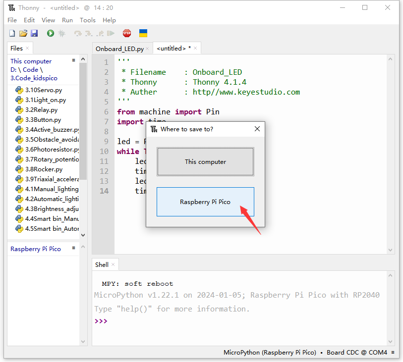

We name it as **main.py**.


After saving, the main.py code will automatically execute as long as the kidspico board is powered on. You will see the yellow LED flashes per second. 


---

## 3. Modules

<span style="color: rgb(2550, 10, 50);">Please move the codes to a convenient path as your needs, for instance, path: **D:\Code\3.Code_kidspico**.</span>

### Kidspico Ports View

During experiments, <span style="color: rgb(2550, 10, 50);">modules can only be connected to ports in the same color.</span>


### 3.1 White LED Module


**LED (Light-Emitting Diode)**

LED is a commonly used light emitting device that converts electrical energy into light energy. Usually, it is used as an indicator in circuits and instruments, or as part of texts or numeric display.

It generally includes gallium(Ga), arsenic(As), phosphorus(P), nitrogen(N) and so on. 

|     LED components      | Emitting light colors |
| :---------------------: | :-------------------: |
| gallium arsenide diode  |          red          |
| gallium phosphide diode |         green         |
|  silicon carbide diode  |        yellow         |
|  gallium nitride diode  |         blue          |


#### Parameters


Operating voltage: DC 3.3 ~ 5 V

Operating current: 1.5 mA (Peak: 2.3mA)

Maximum power: 0.07 W

Control signal: digital signal

Dimensions: 24 x 48 x 18 mm (without housing)

Positioning holes: diameter of 4.8 mm

Interface: telephone socket


#### Principle


Modules with blue housing are digital ones, so we should connect to digital io pins of the mainboard (ports with blue)

In this experiment, we connect the white LED module to port 1. According to the board ports view, the digital io pin at port 1 is io11.

When we set the pin to high(1), the LED lights up in white; if we set to low(0), it will be off.


#### Wiring Diagram


-----------

#### Test Code

Open Thonny and connect to COM port. Open **3.1Light_on.py** in **Files** and click .

```python
'''
 * Filename    : Light_on
 * Thonny      : Thonny 4.1.4
 * Auther      : http//www.keyestudio.com
'''
from machine import Pin
import time

led = Pin(11, Pin.OUT)# Set an led object and connect it to pin 11, set pin to output
while True:
    led.on()     # led on
    time.sleep(1)# delay 1s
    led.off()    # led off
    time.sleep(1)# delay 1s
```

#### Explanations


1. `from machine import Pin`

   Import Pin from machine to enable its functions.


  **machine.pin **

```python
machine.Pin(id,mode,pull,value)
```


   - id ：GPIO number, within 0-29. For example, if you enable GPIO11, fill in with 11.

   - mode ：pin mode can be one of the followings:

     ​	Pin.IN(0) - set pin to input

     ​	Pin.OUT(1) - set pin to (normal)output

     ​	Pin.OPEN_DRAIN(2) - set pin to open drain output

   - pull ：specifies whether the pin is connected to a (weak)pull resistor; it is valid only at input mode, and can be one of the followings:

     ​	None - no pull-up/down

     ​	Pin.PULL_UP(1) - enable pull-up resistor

     ​	Pin.PULL_DOWN(2) - enable pull-down resistor

   - value ：only work at Pin.OUT and Pin.OPEN_DRAIN mode; assign the initial output pin value. Or else, the peripheral state of the pin stays still. 0 is low(off) while 1 is high(on).

   - Pin.on() - set pin to high

   - Pin.off() - set pin to low


2. `import time`

   Import time type so that its related functions can be adopted.


3. `led = Pin(11, Pin.OUT)`

​		Set LED pin io11 to output mode.


Q ：Why "output"?

A ：The code is written for the mainboard. For the board, pin io11 is outputting power levels (high or low) to the connected module.


4. `while True:`

   Statements in this function will execute in a loop.  

   Formula of while loop function:

```python
while conditions(condition)：
    statements(statements)……
```


5. `led.on()` 和 `led.off()`

   At pin io11 on the mainboard, respectively output high(1) and low(0); i.e., output high(1)/low(0) to LED module to make it on/off.


6. `time.sleep(1)` 

   Delay 1s.

   

   Q ：Why delay?

   A ：If you output a high level to LED, it will be always on. Yet, we add a delay of 1s, so it lights up for only 1s. Delay time is the ON/OFF time of LED.
   
   


#### Test Result


After uploading code, the LED module will flash with an interval of 1s (on for 1s and off for 1s).


Click  or Ctrl+C to exit the execution.


---

### 3.2  3V Relay Module


Relay module is seen as an automatic switch which controls large current via small one. In circuits, it plays the role of automatic regulator, safety protector and converter.


#### Parameters


Driving voltage: DC 3.3 ~ 5V 

Driving current: 75 mA(5V) ~ 125 mA(3.3V)

Contact capacity: 250 VAC/3A, 30 VDC/3A

Rated power dissipation: 0.15 W

Input signal: digital signal

Shock current: less than 3 A

Operating temperature: -10°C ~ +50°C

Control signal: digital signal

Dimensions: 24 x 48 x 18 mm (without housing)

Positioning hole: diameter of 4.8 mm

Interface: telephone socket


#### Principle


Internal structure:


The coil inside the relay is wound around the iron core to form an electromagnet, which generates electromagnetic force after powering on. 

A relay usually contains a moving contact and two static contacts.


When there is no current in the coil, the electromagnet is not magnetic and is not attractive to the armature, so the moving contact B is in contact with the static contact A. Therefore, A now becomes the normally closed contact (NC). And the moving contact B is also called the common contact (COM).

NC (normally-close): The coil is closed without power.


When a current flows through the coil, the electromagnet is magnetic so that it will attract the armature. At this time, B and the static contact C will be connected. Static contact C is called normally open contact (NO).

NO (normal open): The coil is opened without power.

The 3V relay module is also a digital device so it need to be connected to digital io pins of the board.

In this experiment, we connect the module to port 2, which is pin io8. When we set the pin to high(1), the relay will work; if we set it to low(0), the relay will out of work.


#### Wiring Diagram


-----------

#### Test Code

Open 3.2Relay.py and click .

```python
'''
 * Filename    : Relay
 * Thonny      : Thonny 4.1.4
 * Auther      : http//www.keyestudio.com
'''
from machine import Pin
import time

relay = Pin(8, Pin.OUT)

while True:
    relay.on()
    time.sleep(1)
    relay.off()
    time.sleep(1)
```

#### Explanation


Codes in this section is same as the last one.

Loop: pin io8 outputs high level to the relay module for 1s and then low low for 1s.


####  Test Result


After uploading code, the relay will work and stop working with an interval of 1s. 

When the relay is conducted, B and C is connected and you will hear a tick-tack, and the red LED on the module will light up. When the relay is opened, A and B is connected with also a tick-tack, and the on-board LED goes off.


Press  or Ctrl+C to exit the execution.


---

### 3.3 Button Module


Button module mainly integrates a touch switch and a yellow button cap. In the previous sections, we have learned how to output power levels. Herein, we will introduce you how to read power levels by programming. 


#### Parameters


Operating voltage: DC 3.3 ~ 5V 

Operating current: 1.1 mA

Maximum power: 0.0055 W

Operating temperature: -10°C ~ +50°C

Control signal: digital signal

Dimensions: 24 x 48 x 18 mm (without housing)

Positioning hole: diameter of 4.8 mm

Interface: telephone socket


#### Principle


Button is a digital module so it should be connected to digital io pins on the board.

We connect the module to port 3 which is digital pin io3. When the button is pressed, the io pin outputs low; when the button is released, the pin outputs high.


#### Wiring Diagram


------------------

#### Test Code

Open 3.3Button.py and click .

```python
'''
 * Filename    : Button
 * Thonny      : Thonny 4.1.4
 * Auther      : http//www.keyestudio.com
'''
from machine import Pin
import time

button = Pin(3, Pin.IN)

while True:
    if button.value() == 0:
        print('The button is pressed!')   #Press to print message
    else:
        print('The button is not pressed!')
    time.sleep(0.1) #delay 0.1s
```

#### Explanation


1. `button = Pin(3, Pin.IN)`

   Set button pin to pin io3, and set the pin to input.


2. `print('The button is pressed!')`

   Print output. **By default**, the output is **wrapping**. Thus, if you do not need a wrapping output, please add *,end=""* after the variable.

   Print *The button is pressed!* on Shell.


3. ```python
   if button.value() == 0:
       print('The button is pressed!')   #Print message
   else:
       print('The button is not pressed!')
   time.sleep(0.1) #delay 0.1s
   ```

   Python's if statement determines which block of code to execute by the result of one or more statements (True or False).

   **Code execution**:

   

   formula of **if statement**:

   ```python
   if condition_1:
       statement_block_1
   elif condition_2:
       statement_block_2
   else:
       statement_block_3
   ```
   
   If "condition_1" is True, execute "statement_block_1".
   
   If "condition_1" is False, execute "condition_2".

   If "condition_2" is True, execute "statement_block_2".

   If "condition_2" is False, execute "statement_block_3".

   If the board reads the button module is at LOW, print *The button is pressed!*; If it reads HIGH, print *The button is not pressed!*; and the state will be refreshed every 0.1 seconds.


#### Test Result


After uploading code, press the button and the Shell prints **The button is pressed!**; release the button, Shell displays **The button is not pressed!**.


Click  or press Ctrl+C to exit execution.


---

### 3.4 Active Buzzer


Buzzer is an electronic sound device with integrated structure. It is powered by DC voltage and is widely used in computer, printer, copier, alarm, electronic toys, automotive electronic equipment, telephone and timer. 

According to the drive mode, it can be divided into active buzzer (internal drive circuits) and passive buzzer (external driver). The difference of the two types is the presence or absence of excitation source.

Active buzzer includes an internal vibration source, so can be triggered to make sound with a fixed frequency. It can be controlled through simple program but with high sound pressure.

However, passive buzzer excludes a vibration source. If the direct current signal is transmitted to a passive buzzer, it will not work. Generally, we drive through square waves with different frequency to achieve different sound effects.

**To sum up, The active buzzer contains a vibration source, and its sound frequency is fixed. Yet there is no vibration source inside the passive one, so it must be driven by square waves whose frequency can be changed to control sounds.**


#### Parameters


Operating voltage: DC 3.3 ~ 5V 

Operating current: 22.5 mA

Maximum power: 0.12 W

Frequency: 2300 Hz

Operating temperature: -10°C ~ +50°C

Input signal: digital signal

Dimensions: 24 x 48 x 18 mm (without housing)

Positioning hole: diameter of 4.8 mm

Interface: telephone socket


#### Principle


Active buzzer is a digital module so it should be connected to digital io pins on the board.

We connect the module to port 4 which is digital pin io2. When the io pin outputs high(1), the buzzer emits sound; when the pin outputs low(0), the buzzer stops alarming.


#### Wiring Diagram


--------------

#### Test Code

Open 3.4Active_buzzer.py and click.

```python
'''
 * Filename    : Active_buzzer
 * Thonny      : Thonny 4.1.4
 * Auther      : http//www.keyestudio.com
'''
from machine import Pin
import time

Buzzer = Pin(2,Pin.OUT)

while True:
    Buzzer.on()
    time.sleep(1)
    Buzzer.off()
    time.sleep(1)
```

#### Explanation


Codes in this section is same as 3.1.

Loop: pin io2 outputs high level to the buzzer for 1s and then low low for 1s.


#### Test Result


After uploading code, the buzzer will alarm and stop alarming with an interval of 1s. 

Click  or press Ctrl+C to exit execution.


---

### 3.5 Obstacle Avoidance Sensor


There are many types of infrared obstacle avoidance sensors, but most of them are the same in principle. They consist of a pair of infrared light emitting tube, infrared light receiving tube and sensor circuits. The transmitting tube emits infrared light, and the receiving tube receives infrared light. When the returned infrared light is not received, the signal pin outputs high; when it is received, the pin outputs low.


#### Parameters


Operating voltage: DC 5V 

Operating current: 6.8 mA

Maximum Power: 0.034 W

Maximum detection distance: 173 mm

Operating temperature: -10°C ~ +50°C

Detection range: 2 ~ 40 cm

Dimensions: 24 x 48 x 18 mm (without housing)

Positioning hole: diameter of 4.8 mm

Interface: telephone socket


#### Principle


Infrared transmitter TX emits infrared signals with a certain frequency, and the infrared signal will gradually decay with the increase of transmission distance. If they encountered obstacles, they will reflect. 

When the signal reflected back by the receiving tube RX is weak, the pin outputs a high level, indicating that the obstacle is far away.

When the reflected signal is relatively strong, the pin outputs low, indicating that the obstacle is relatively close, and the indicator is on. 

We can adjust the effective distance via two potentiometers: one adjusts the transmitting power, the other adjusts the receiving frequency.

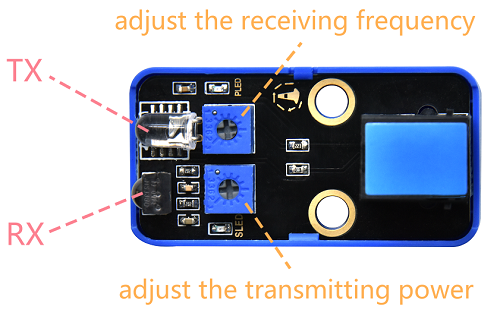

The obstacle avoidance sensor is a digital module so it should be connected to digital io pins on the board.

We connect the module to port 6 which is digital pin io22. When the sensor detects obstacles, the io pin outputs low. When it detects nothing or the obstacle is far away from the sensor, the pin outputs high.


#### Wiring Diagram


---------------

#### Test Code

Open 3.5Obstacle_avoidance.py and click .

```python
'''
 * Filename    : Obstacle_avoidance
 * Thonny      : Thonny 4.1.4
 * Auther      : http//www.keyestudio.com
'''
from machine import Pin
import time
 
Obsensor = Pin(22,Pin.IN)

while True:
    print(Obsensor.value(), end='')
    if Obsensor.value() == 0:
        print('  Obstruction ahead!')
    else:
        print('  All going well!')
    time.sleep(0.1)
```

After uploading code, we need to rotate the two potentiometers for calibration. Otherwise the sensor cannot detect correctly.

<span style="color: rgb(10, 10, 200);">**NOTE:** When adjusting the sensor, ensure there is no obstacles block it. Otherwise, the detection distance will be inaccurate.</span>


Firstly, adjust the transmitting power, turn the potentiometer clockwise to the end. And then turn it back slowly counterclockwise. 

When the SLED light is on, rotate the potentiometer clockwise till the SLED is just <span style="color: rgb(10, 10, 200);">OFF</span>.


Then, adjust the  receiving frequency, turn the potentiometer clockwise to the end. And then turn it back slowly counterclockwise. 

When the SLED light is on, rotate the potentiometer clockwise till the SLED is just <span style="color: rgb(10, 10, 200);">OFF</span>. At this time, the detection distance is the farthest.


After adjustment, now it's ready to use!

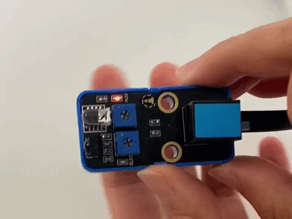

-----------------

#### Explanation


1. `print(Obsensor.value(), end='')`

   print output. **By default**, the output is **wrapping**. Thus, if you do not need a wrapping output, please add *,end=""* after the variable. 
   
   In this way, the sensor value and the status result can be output in the same line.


2. `print('  Obstruction ahead!')`

   Two space: if there is no space, the status result will be close to "*Obstruction ahead!*", as follows:

   

   With space:

   


#### Test Result


After uploading code, when the sensor detects obstacles, the sensor outputs low and the status value is 0, the SLED lights up, and Shell prints *Obstruction ahead!*

When the sensor detects nothing, the sensor outputs high and the value is 1, the SLED goes off, and Shell displays *All going well!*


Click  or Ctrl+C to exit the execution.


---

###  3.6 Photoresistor


The sensors we have learned before are all digital modules. For instance, button module: when the button is released, we read a high level (3.3V), and when the it is pressed, we read low (0V). 

However, the voltage between 0 ~ 3.3V cannot be read by the digital IO port. So we adopt analog modules that can read the intermediate voltage value through the ADC analog port on the board.

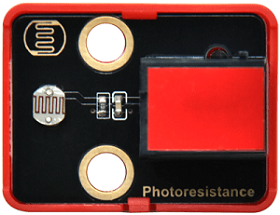

A photoresistor is an analog sensor, which is mainly composed of a photoresistor element. The resistance changes with the light intensity, so we can take advantage of the sensor to design circuit that converts resistance change to voltage change. 

For applications, the photoresistor is able to simulate people's judgment of the intensity of the ambient light.


#### Parameters


Operating voltage: DC 3.3 ~ 5V 

Current: 0.2 mA

Maximum power: 0.001 W

Operating temperature: -10°C ~ +50°C

Output signal: analog signal

Dimensions: 24 x 48 x 18 mm (without housing)

Positioning hole: diameter of 4.8 mm

Interface: telephone socket


#### Principle


The photoresistor is based on the internal photoelectric effect. The stronger the light is, the lower the resistance will be.


The light intensity changes, and the resistance also changes, and the voltage detected by the analog port also changes (among 0 ~ 3.3V). This voltage change is a continuously analog value(any value within 0 ~ 3.3V).

The board can not directly process analog signals which needs to be converted into digital signals, so the analog value should take an ADC(Analog to Digital Converter) acquisition.


**What is ADC?**

ADC(Analog to Digital Converter) converts analog values to digital ones. The board has integrated ADC acquisition, which can be used directly.

**Kidspico ADC Technical Parameters**

1. Resolution: 12 bit

   An n-bit ADC means that the ADC has 2ⁿ scales. A 10-bit ADC contains a total of $2^{12}=4096$ scales, which outputs a total of 4096 digits (0~4095) with each scale of $\frac{3.3}{4095}≈0.00081(V)$.

2. General ADC input voltage calculation:

   <font face="courier New" color="black" size=6>$ Vin=\frac {AVDD_{ADC}}{2^{Resolution Bits}-1}*ReadData$</font> 

   $AVDD_{ADC}$: Reference voltage

3. ADC channel: 5 channels 

   Channel ADC0-ADC3 are GPIO 26-29. You can use the first three channels ADC0, ADC1, ADC2, which is also the way of analog voltage measurement. The ADC3 is used to measure the on-board VSYS voltage.

   The built-in ADC4 cannot be used at the pin for measuring onboard temperature sensors.	


This is an analog module, which need to be connected to the analog io pins (analog port is in red on the board). 

We connect the module to port 7 which is io27. When light shines on the photoresistor, it outputs the converted digital signal value.


#### Wiring Diagram

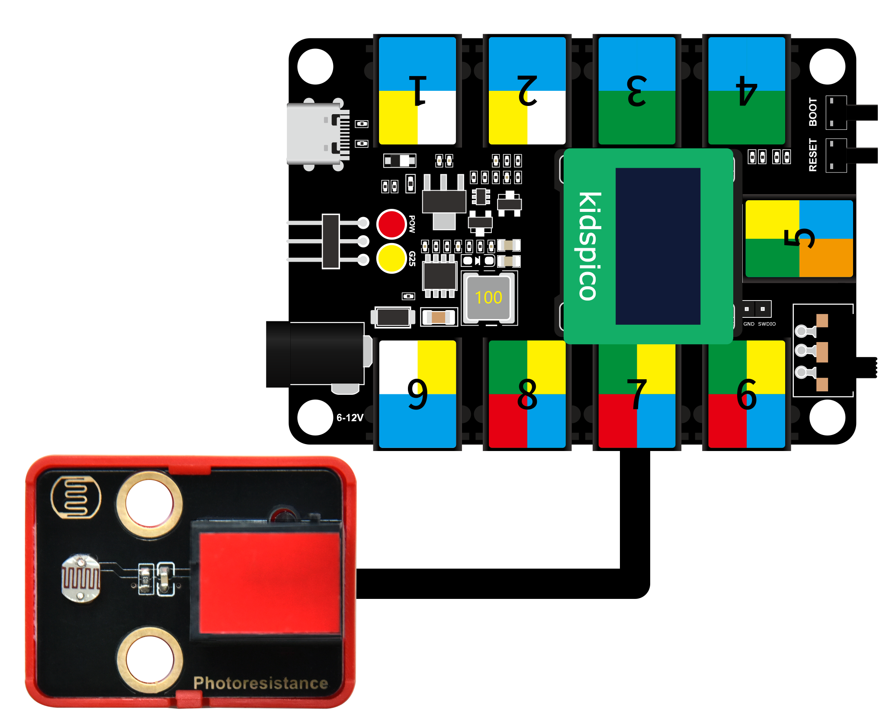

----------------------

#### Test Code

Open 3.6Photoresistor.py and click .

```python
'''
 * Filename    : Photoresistor
 * Thonny      : Thonny 4.1.4
 * Auther      : http//www.keyestudio.com
'''
# import ADC module
from machine import ADC
import time

# configuire ADC, range 0-3.3V
# define io26,io27,io28,io29 to ADC channel 0,1,2,3
Photores = ADC(27)  #or: Photores = ADC(1)
conversion_fator = 3.3 / 65535 #Voltage value of a single scale

# read ADC value every 0.1 seconds, convert the ADC value into a voltage output
while True:
    Photores_Value = Photores.read_u16()
    voltage = Photores_Value * conversion_fator
    print('ADC Value:',Photores_Value,'   Voltage:',voltage,'V')
    time.sleep(0.1)
```

#### Explanation


1. `from machine import ADC`

   Import ADC module.

   

   **machine.ADC Function**

   - `machine.ADC(id)`	: The ADC object constructs function and initializes the corresponding ADC channel.

     id: GPIO(PIN) object, (GPIO26 ~ 29); or ADC channel (0 ~ 3).

   - `ADC.read_u16() `	: Read the ADC value of the corresponding channel and return the read value.

     ATTENTION: <span style="color: rgb(10, 10, 200);">In MicroPython, the ADC is converted to a 16-bit calculation(from 0 to 65535). This function does not directly return the value read by the ADC, but the processed value (range 0 - 65535).</span>

     ADC voltage calculation: 
     
     <font face="courier New" color="black" size=6>$ Vin= \frac {3.3*ReadData}{65535}$</font>


2. `Photores = ADC(27)` 

   Define ADC1 to receive the analog value received by the photosensor.

   Channel ADC0 - ADC3 are GPIO 26 - 29, among which ADC0, ADC1, ADC2 are available.


3. `conversion_fator = 3.3 / 65535` 

   The voltage value of one scale.


4. `Photores_Value = Photores.read_u16()`

   Read the value of the channel ADC1 and return the read value.

    `read()` reads the digital input;  `read_u16()` reads the analog input. 
   
    `u16` receives not a binary 0 or 1, but a 16-bit integer, that is, an integer between 0 and 65535.


5. `voltage = Photores_Value * conversion_fator`

   Voltage conversion: the analog value read * the voltage value of a single scale.


#### Test Result


After uploading code, Shell prints the ADC value received by the photoresistor and the converted voltage. The stronger the light is, the larger the ADC and voltage value will be.


Press  or Ctrl+C to exit execution.


---

### 3.7 Potentiometer


Potentiometer is an analog module which mainly consists of rotary resistor, knob and connector. When we rotate the knob, the connector will be linked to different built-in resistors, so that the output resistance/voltage changes.

In circuits, potentiometers are widely used for device adjustment, volume control and frequency control.


#### Parameters


Operating voltage: DC 3.3 ~ 5V 

Operating current: 0.55 mA

Operating power: 0.00275 W

Operating temperature: -10°C ~ +50°C

Output signal: analog signal

Dimensions: 24 x 48 x 28.6 mm (without housing)

Positioning hole: diameter of 4.8 mm

Interface: telephone socket


#### Principle


The potentiometer is an analog module so it should be connected to analog io pins on the board.

We rotate the knob to change resistance, so that the current/voltage changes.


**Resistor**

Resistor is a current-limiting element. Generally, we connect its two pins into the circuit to limit the amount of current passing through it.

Resistance of fixed resistors are constant, while that of variable ones can be changed according to conditions.

Here are some types of resistors.

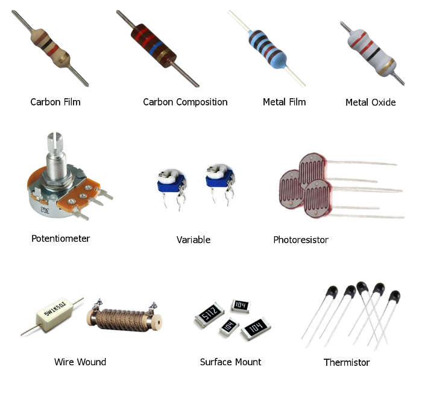

**Potentiometer**

Potentiometer is a resistance element with three leading terminals, whose resistance can be adjusted according to a certain law. It is usually composed of a resistor and a movable brush, so it belongs to variable resistor.

The principle of the potentiometer: Constant voltage is applied to its terminals (terminal ① and terminal ③), and we rotate the reed to change the output of the resistance.


We connect the module to port 8 which is io26. When we rotate the knob, the digital value converted from resistance will be output.


#### Wiring Diagram


---------------

#### Test Code

Open 3.7Rotary_potentiometer.py and click .

```python
'''
 * Filename    : Rotary_potentiometer
 * Thonny      : Thonny 4.1.4
 * Auther      : http//www.keyestudio.com
'''
from machine import ADC
import time

# configure ADC, range 0-3.3V
# define io26,io27,io28,io29 to ADC channel 0,1,2,3
RP = ADC(26) #or: Photores = ADC(0)
conversion_fator = 3.3 / 65535 #Voltage value of a single scale

#read ADC value every 0.1 seconds to convert it into voltage output
while True:
    RP_Value = RP.read_u16()    
    voltage = RP_Value * conversion_fator
    print('ADC Value:',RP_Value,'   Voltage:',voltage,'V')
    time.sleep(0.1)
```

#### Explanation


Codes in this section is same as the last experiment.


#### Test Result


After uploading code, rotate the potentiometer, and the Shell prints the current ADC value and the converted voltage value.


Click  or press Ctrl+C to quit the execution.


---

### 3.8 Joystick	


This module adopts PS2 joystick potentiometer, which includes (X, Y) axis analog output, (Z) axis button digital output. These X, Y, Z values may achieve specific functions.


#### Parameters


Operating voltage: DC 3.3 ~ 5V 

Current: 12 mA

Maximum power: 0.06 W

Operating temperature:-10°C ~ +50°C

Dimensions: 24 x 48 x 33.4 mm (without housing)

Positioning hole: diameter of 4.8 mm

Interface: telephone socket


#### Principle


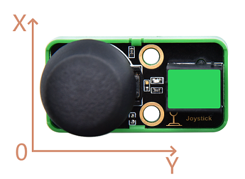


**I2C Interface**

I2C/IIC/I2C bus (Inter-Integrated Circuit) is a two-wire serial bus developed by PHILIPS for MCU, which is suitable for the interface connection between MCU and peripheral devices.

IIC communicates over two lines: Clock channel (SCL) and Data Channel (SDA).

Both terminals must be connected to kidspico's specific pins: SCL is connected to pin io5; SDA is connected to pin io4.


IIC module(in green housing) needs to connect it to IIC ports. All digital IIC ports are with green sticker on the board.

We need to import ROCKER library first, so then the values of the X, Y, and Z axes can be read.


#### Wiring Diagram


-----------------------

#### Test Code

Open 3.8Rocker.py.

Before uploading code, import libraries to kidspico. 

Find ROCKER.py and choose *Upload to /*.


The library is added.


<span style="color: rgb(2550, 10, 50);">Before click  to run code, please ensure the IIC module is connected to the correct port to adoid errors.</span>

```python
'''
 * Filename    : Rocker
 * Thonny      : Thonny 4.1.4
 * Auther      : http//www.keyestudio.com
'''
from machine import Pin
import time
from ROCKER import rocker

scl = Pin(5) 
sda = Pin(4)
bus = 0
snsr = rocker (bus, scl, sda)
while True:
    x,y,z = snsr.readXYZ()
    print('x:',x,'y:',y,'b:',z)
    time.sleep(0.1)
```

#### Explanation


1. `from ROCKER import rocker`

   Import rocker function.


**ROCKER.rocker**

- `rocker.readXYZ()`	: read X, Y, Z axis value and return them.


2. `snsr = rocker (bus, scl, sda)`

   set the initial value of bus, scl, sda.


3. `x,y,z = snsr.readXYZ()`

   read the values on X, Y, Z axis


4. `print('x:',x,'y:',y,'b:',z)`

   Print the values on X, Y, Z axis. Characters should be enclosed in quotation marks, and values and characters should be separated by commas.


#### Test Result


After uploading code, the Shell prints *rocker found* first(it means a successful connection), and then displays the values in X, Y, Z axis. 

Value on X-axis increases from 0 to 1023 in the direction of the arrow. Value on Y-axis increases from 0 to 1023 in the direction of the arrow. Press the joystick and the value on z-axis is 1; release it and the value on z-axis is 0.


Move the joystick on the X-axis to make the value increase.


Move the joystick on the Y-axis to make the value increase.


Press the joystick and the value b changes from 0 to 1.


Click  or press Ctrl+C to exit the execution.


---

### 3.9 SC7A20 3-Axis Acceleration Sensor


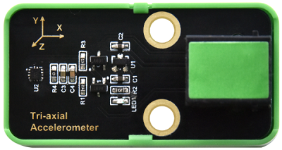

This sensor is used to measure the acceleration of an object in three axes (X, Y and Z). It features small size and light weight, and can fully and accurately reflect the motion properties of the object. In application, it is widely used in aerospace, robotics, automotive and medical fields.

SC7A20 is a high-precision 12-bit digital three-axis acceleration sensor chip with multiple functions, low power consumption, small size and accurate measurement.


#### Parameters


Operating voltage: DC 3.3 ~ 5V 

Operating current: 30 uA

Operating power: 0.000015 W

Operating temperature: -10°C ~ +50°C

Output signal: analog signal

Dimensions: 24 x 48 x 18 mm (without housing)

Positioning hole: diameter of 4.8 mm

Interface: telephone socket


#### Principle


The sensor measures spatial acceleration(the speed of the object in space). The three-axis acceleration is mainly to decompose in X, Y, and Z three axes.


Acceleration sensor is mainly divided into piezoelectric, capacitive and thermal response. 

According to the number of input axes, there are single axis, two axis and three axis accelerometers. 

According to the different output signals, there are analog and digital(the analog output value is voltage, digital output value is digital signal). Analog sensors also need to add digital-to-analog converter (ADC), but the analog one has integrated ADC circuit, so can be directly transmit data through the communication interface(SPI, I2C, etc.).

The SC7A20 acceleration sensor is also an IIC module so needs to be connected to IIC port.

We need to import the SC7A20 library to read the acceleration values on the X, Y and Z axes.


#### Wiring Diagram


-----------------------

#### Test Code

Open 3.9Triaxial_acceleration.py.

Find SC7A20.py library and choose *Upload to /* to kidspico board.


<span style="color: rgb(2550, 10, 50);">Before clicking , make sure the IIC module is connected to the board.</span>

```python
'''
 * Filename    : Triaxial_acceleration
 * Thonny      : Thonny 4.1.4
 * Auther      : http//www.keyestudio.com
'''
from machine import Pin
import time
from SC7A20 import sc7a20

scl = Pin(5) 
sda = Pin(4)
bus = 0
Triaxial = sc7a20(bus, scl, sda)
while True:
    x,y,z = Triaxial.readXYZ()
    print('x:',x,'y:',y,'z:',z)
    time.sleep(0.1)
```

#### Explanation


1. `from SC7A20 import sc7a20`

   Import sc7a20 function.


**SC7A20.sc7a20**

- `sc7a20.readXYZ()`	: read the acceleration value on X, Y, Z axis and return them.


2. `Triaxial = sc7a20(bus, scl, sda)`

   set the initial value of bus, scl, sda.


3. `x,y,z = Triaxial.readXYZ()`

   read the acceleration value on X, Y, Z axis.


4. `print('x:',x,'y:',y,'z:',z)`

   print the acceleration value on X, Y, Z axis.


#### Test Result


After uploading code, shake the SC7A20 acceleration sensor, and the Shell prints the acceleration sensor on X, Y, Z axis.


Click  or press Ctrl+C to exit.


---

### 3.10 Servo


Generally, servo exports three wires in three colors: brown, red and orange. Brown is the grounded, red is the positive, and orange is signal. The wire colors may vary from brands.


#### Parameters


Operating voltage: DC 3.3 ~ 5V 

Rated voltage: 4.8V

Rated current: 200 mA

Angular speed: 60°/0.12s

Operating temperature: -10°C ~ +50°C

Length: Five Lego hole units 8x5 = 40 mm

Width: Two Lego width units 8x2 = 16 mm

Height: Three Lego height units 3.2x3 = 9.6 mm

Base hole position: diameter of 4.8

Interface: 3pin interface with a spacing of 2.54 mm


#### Principle


Servo is generally controlled by PWM (pulse width modulation). Herein, this 270°(0°  ~ 270°) servo is compatible with LEGO.


Rotation range of 270° servo: -45° ~ 225°, which is 270° in total, rather than rotating to 270°.


**What is PWM?**

PWM (Pulse width modulation) simulates the change of analog signal through digital signal.

Pulse width is the high level in a complete square wave cycle. So, pulse width modulation is to adjust the high level(of course, in other words, low level is also adjusted).


- PWM frequency

  the number of times the signal going from high level to low level and back to high level in 1 second (one cycle), that is, how many cycles there are in a second.

  Unit: Hz

  Expression: 50Hz 100Hz

- PWM cycle

  $ T= \frac {1}{f}$      $ cycle = \frac {1}{frequency}$

  If the frequency is 50Hz, the cycle will be 20ms, i.e., there are 50 PWM cycles in one second.

- PWM duty cycle

  The ratio of high level time to the whole cycle time.

  Unit: %（1% ~ 100%）

  

- Cycl: The time of a pulse signal. The number of cycles in 1s equals the frequency.

- Pulse width time: high level time.


|            Servo            |         |                      |
| :-------------------------: | :------------------------------: | :-------------------------------------------: |
|          **Type**           |            270° servo            |                  360° servo                   |
|      **Drive circuit**      |                no                |                      no                       |
| **Control rotation angle?** |               yes                |                      no                       |
|  **Continuous rotation?**   |                no                |                      yes                      |
|        **Features**         | able to control angle(0° ~ 270°) | Signals regulate rotation direction and speed |

<center> Servo Comparison Table</center>

The connection terminal of 270° servo is a 3-pin headers with a 2.54mm pitch, which needs to be connected to the pin interfaces. 

We connect servo to io19.


#### Wiring Diagram


-------------

#### Test Code

Open 3.10Servo.py and click .

```python
'''
 * Filename    : Servo
 * Thonny      : Thonny 4.1.4
 * Auther      : http//www.keyestudio.com
'''
from machine import Pin, PWM
import time

servo = PWM(Pin(19))
servo.freq(50)  #T = 1/f = 20ms

def angle(x):
    return int((((x + 45) * 1.8 / 270) + 0.6 )/ 20 *65535)

while True:   
    servo.duty_u16(angle(-45))
    time.sleep(1)
    servo.duty_u16(angle(0))
    time.sleep(1)
    servo.duty_u16(angle(90))
    time.sleep(1)
    servo.duty_u16(angle(180))
    time.sleep(1)
    servo.duty_u16(angle(225))
    time.sleep(1)
```

#### Explanation


1. `from machine import Pin, PWM`

   import PWM function.


  **machine.PWM**

- `machine.PWM(pin)`: PWM object function, specifies that GPIO is reinitialized and set to PWM output mode.

     pin: GPIO pin that is set to PWM output mode

- `PWM.freq(value)`: PWM output frequency function

     value: PWM output frequency. The value should conform to the PWM frequency calculation formula.

- `PWM.duty_u16(value)`: set duty cycle, the corresponding value is calculated automatically.

     value: duty cycle ratio, within 0-65536.

- `PWM.duty_ns(value)`: Set the length of time (in ns) for output high level of a cycle.

	value: duty cycle ratio, within 0-65536.


2. `pwm = PWM(Pin(19))` 

   set servo pin to io19 output PWM.


3. `pwm.freq(50)`

   set PWM output frequency to 50.
   
   According to the principle, servo control generally requires a pulse of about 20ms(0.02s), so $ f= \frac {1}{T} =\frac {1}{0.02}=50$


4. ```python
	def angle(x):
	    return int((((x + 45) * 1.8 / 270) + 0.6 )/ 20 *65535)
	```

	Define a function angle to calculate the corresponding **value** in `PWM.duty_u16(value)` . You only need to set x to the angle you need (range: -45 ~ 225).

	**Extension:**

	270° servo pulse width:

	-45°: 600us(0.6ms)

	90°: 1500us(1.5ms)

	180°: 2400us(2.4ms)

	The control of servo requires a pulse of about 20ms, of which the high level is within the range of 0.6ms ~ 2.4ms, corresponding to the starting and end position of the rotation Angle.


5. `servo.duty_u16(angle(-45))`

   Call angle() function to set PWM duty cycle. Here we set to the duty cycle corresponding to -45°.


#### Test Result


After uploading code, servo rotates from -45° to 0° and stops for 1s; then it rotates to 90° with a delay of 1s; then it rotates to 180° and then to 225° with intervals of 1s. After these steps, it will back to -45°, in a circulation.

Click  or press Ctrl+C to exit.


---

## 4. Comprehension

### 4.1 Manual Lighting

In this experiment, we will apply both LED module and button module to form a lighting device.

#### Flow


#### Assembly


**Required:**


**Step 1**

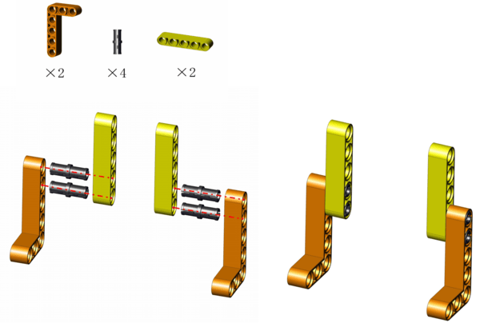


**Step 2**


**Step 3**


**Step 4**


**Step 5**

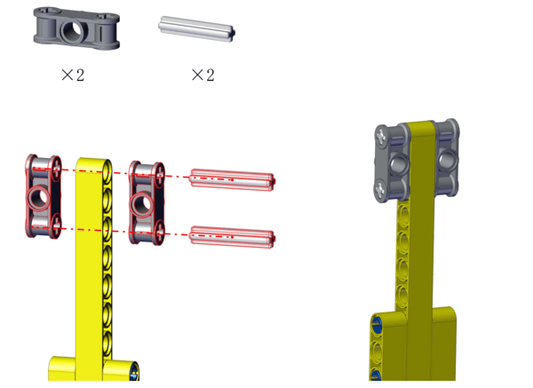


**Step 6**


**Step 7**


**Step 8**


**Completed!**


#### Wiring Diagram


#### Test Code

Open 4.1Manual_lighting.py and click.

```python
'''
 * Filename    : Manual_lighting
 * Thonny      : Thonny 4.1.4
 * Auther      : http//www.keyestudio.com
'''
from machine import Pin
import time

led = Pin(11, Pin.OUT)
button = Pin(3, Pin.IN)

while True:
    if button.value() == 0:  #press button
        led.on()     # led on
    else:
        led.off()    # led off
```

#### Explanation


**Conceive:**		

1. Initialization: Set pins of white LED module and button module

2. Loop:

   Determine whether the button is pressed. If it is, LED will light up. If not, LED will go off.


#### Test Result


After uploading code, press the button, and LED lights up. When you release the button, LED is off.


---

### 4.2 Automatic Lighting

Herein, we combine the photoresistor and LED module to design an automatic lighting system.

#### Flow


#### Assembly


**Required:**


**Step 1**


**Step 2**

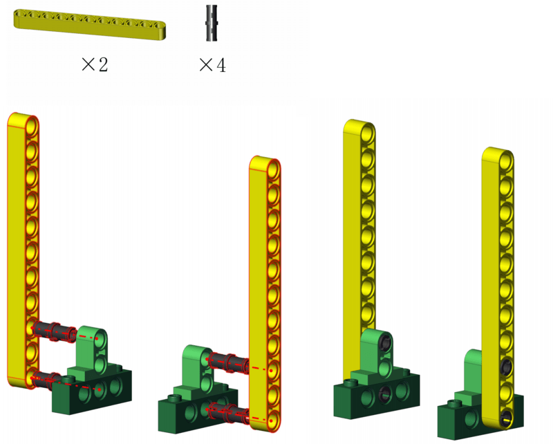


**Step 3**

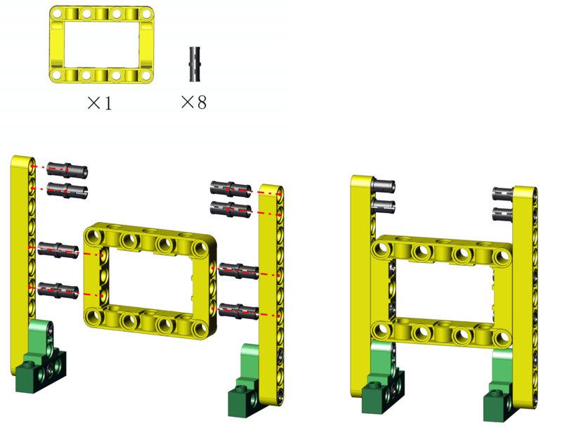


**Step 4**


**Step 5**


**Step 6**


**Step 7**


**Step 8**


**Step 9**


**Completed!**

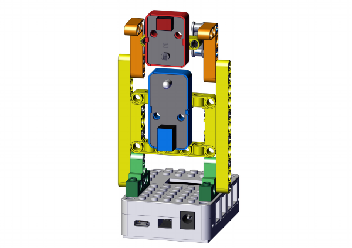


#### Wiring Diagram


#### Test Code

Open 4.2Automatic_lighting.py and click .

```python
'''
 * Filename    : Automatic_lighting
 * Thonny      : Thonny 4.1.4
 * Auther      : http//www.keyestudio.com
'''
from machine import Pin,ADC
import time

led = Pin(11,Pin.OUT)
Photores = ADC(27)  

while True:
    Photores_Value = Photores.read_u16()
    print('ADC Value:',Photores_Value)
    if (Photores_Value < 10000):
        led.on()
    else:
        led.off()
    time.sleep(0.1)
```

#### Explanation


**Conceive:**

1. Initialization: set the pins of LED module and the photoresistor.

2. Loop: 

   ① read the value of photoresistor and print it on Shell.

   ② Determine whether the value id less than 10000(the threshold can be changed according to needs).

   - If the value is less than 10000, LED will be on.

   - If the value equals or is greater than 10000, LED will go off.


#### Test Result


Upload code and the photoresistor starts to detect the ambient light intensity.

In room, when the light is sufficient (the value is greater than 10000), the LED is off.

When the ambient light is weak (the value is less than 10000), the LED is on. 

In the code, the threshold value 10000 can be modified according to your needs.


---

### 4.3 Light Adjustment

In this experiment, we will introduce how to adjust the brightness of LED module via a potentiometer.

#### Flow


#### Assembly


**Required:**


**Step 1**

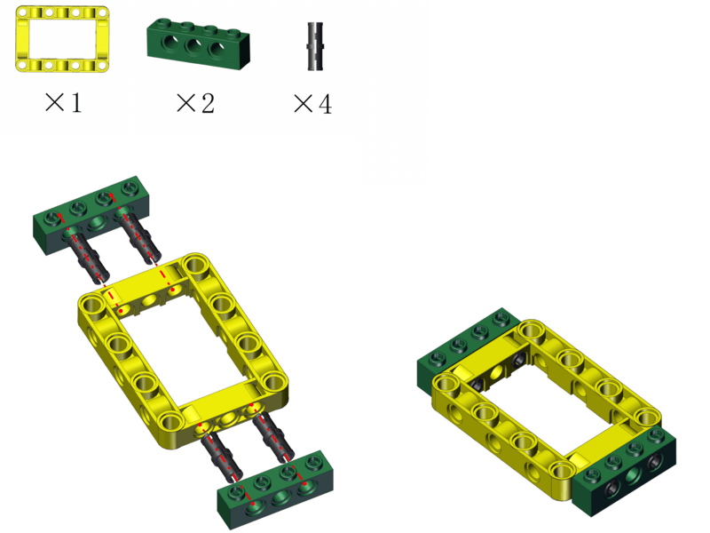


**Step 2**

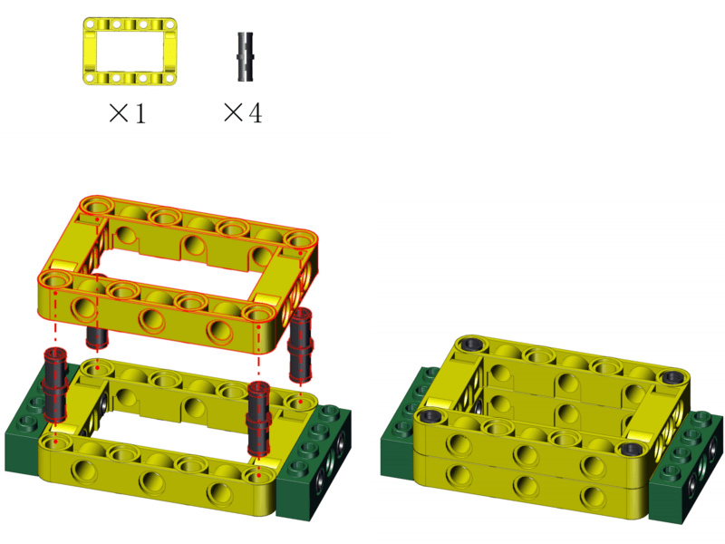


**Step 3**


**Step 4**


**Step 5**


**Step 6**


**Step 7**


**Completed!**


#### Wiring Diagram


#### Test Code

Open 4.3Brightness_adjustment.py and click.

```python
'''
 * Filename    : Brightness_adjustment
 * Thonny      : Thonny 4.1.4
 * Auther      : http//www.keyestudio.com
'''
from machine import Pin,ADC,PWM
import time

RP = ADC(26)
led = PWM(Pin(11))
led.freq(1000)

while True:
    RP_Value = RP.read_u16()
    print('ADC Value:',RP_Value)
    led.duty_u16(RP_Value)
    time.sleep(0.1)
```

#### Explanation


1. `from machine import Pin,ADC,PWM`

   import PIN, ADC, PWM module.


2. `led = PWM(Pin(11))`

   a PWM function whose PWM output pin is io11.

3.  `led.freq(1000)`

   Set PWM output frequency to 1000Hz.

4. `led.duty_u16(RP_Value)`

   Set duty cycle, set the value output by the potentiometer to the duty cycle of the white LED module.

**Conceive:**

1. Initialization: set the pins of potentiometer and white LED module, set the output frequency of the LED module.

2. Loop: 

   ① Read the ADC value of potentiometer, and print it on Shell.

   ② Set the value as the duty cycle of white LED module, so that the potentiometer controls the brightness of LED.


#### Test Result


Upload code and rotate the potentiometer, and the LED brightness will change accordingly. The greater the ADC is, the brighter the LED will be.


---

### 4.4 Smart Trash Can (Manual Mode)

In this project, we use a joystick and a servo to control the trash can lid.

#### Flow


#### Assembly


**Required:**


**Step 1**


**Step 2**


**Step 3**


**Step 4**


① Hold the lid still to make it align with the hole.

② Insert the rod.

<span style="color: rgb(10, 10, 200);">ATTENTION: Keep the lid flatwise.</span>


**Step 5**

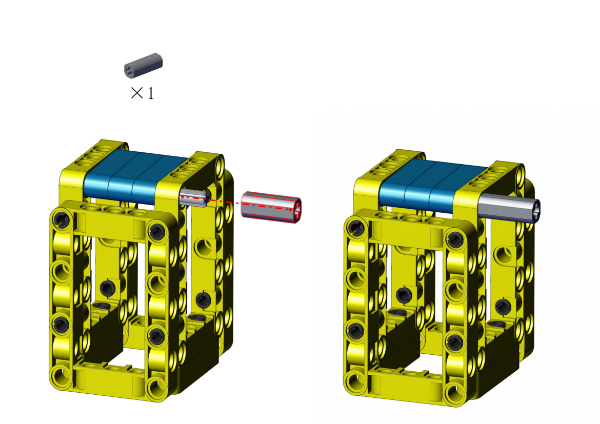


**Step 6**


**Step 7**

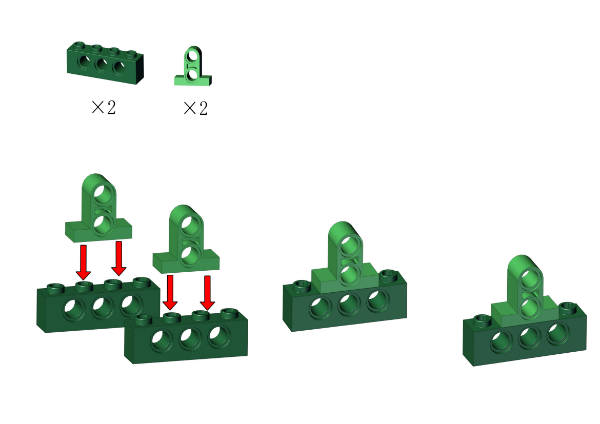


**Step 8**


**Step 9**


**Step 10**


The servo need to be calibrated before using. Connect the servo to pin io19 on the board and link the board to computer via USB cable.


Open Servo_Calibration.py and click .
```python
'''
 * Filename    : Servo_Calibration
 * Thonny      : Thonny 4.1.4
 * Auther      : http//www.keyestudio.com
'''
from machine import Pin, PWM
import time

servo = PWM(Pin(19))
servo.freq(50)  #T = 1/f = 20ms

def angle(x):
    return int((((x + 45) * 1.8 / 270) + 0.6 )/ 20 *65535)

while True:   
    servo.duty_u16(angle(90))
```

After calibration, disconnect the board to computer and continue to mount.

<span style="color: rgb(10, 10, 200);">ATTENTION: During mounting, please hold and keep the lid flatwise.</span>

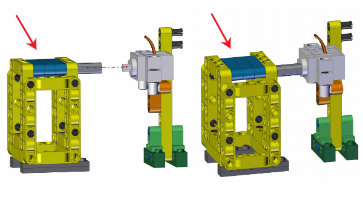


**Step 11**

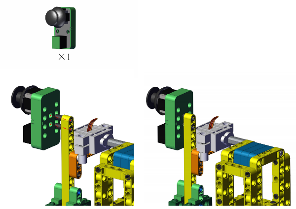


**Step 12**


**Completed!**


#### Wiring Diagram


#### Test Code

Open 4.4Smart bin_Manual mode.py and click .

```python
'''
 * Filename    : Smart bin_Manual mode
 * Thonny      : Thonny 4.1.4
 * Auther      : http//www.keyestudio.com
'''
from machine import Pin,PWM
import time
from ROCKER import rocker

servo = PWM(Pin(19))
servo.freq(50)  #T = 1/f = 20ms

def angle(x):
    return int((((x + 45) * 1.8 / 270) + 0.6 )/ 20 *65535)

scl = Pin(5) 
sda = Pin(4)
bus = 0
snsr = rocker (bus, scl, sda)

while True:
    x,y,z = snsr.readXYZ()
    print('y:',y)
    time.sleep(0.1)
    if 0 <= y < 490:
        servo.duty_u16(angle(-45))
    else:
        servo.duty_u16(angle(90))
```

#### Explanation


- `<=`

   Comparison operator: less than or equal to, it determines whether the left value is less than or equal to the right, and then True or False will be returned.

**Conceive:**

1. Initialization: set the pins of IIC and servo, set the servo output frequency.

2. Loop:

   ① read the value of joystick in y-axis and refresh it every 0.1 seconds, and print it on Shell.

   ② determine whether the value in y-axis is within 0 to 490 (with the servo being calibrated, the trash can lid is closed at this time).

   - True: the servo rotates to -45° to open the lid.
   - False: the servo rotates to 90° to close the lid.


#### Test Result


Upload code and push the joystick as follows, and the lid will open. If you release the joystick, the lid will close. Now you can control the trash can manually!


---

### 4.5 Smart Trash Can (Automatic Mode)

We will construct an automatic trash can with obstacle avoidance sensor, active buzzer and servo.

#### Flow


#### Assembly


**Required:**


Step 1 to 10 are the same as those in 4.4, so you can directly use <span style="color: rgb(10, 10, 200);">the form in 4.4</span> here.

① Remove the joystick.

② mount from step 11.

Yet if <span style="color: rgb(10, 10, 200);">you have not assemble the building blocks in 4.4</span>, please start from step 1.


**Step 1**


**Step 2**


**Step 3**


**Step 4**


① Hold with your fingers.

② Insert the rod. 

<span style="color: rgb(10, 10, 200);">ATTENTION: keep the lid flatwise.</span>


**Step 5**


**Step 6**


**Step 7**


**Step 8**


**Step 9**


**Step 10**


The servo need to be calibrated before using. Connect the servo to pin io19 on the board and link the board to computer via USB cable.


Open Servo_Calibration.py and click .

```python
'''
 * Filename    : Servo_Calibration
 * Thonny      : Thonny 4.1.4
 * Auther      : http//www.keyestudio.com
'''
from machine import Pin, PWM
import time

servo = PWM(Pin(19))
servo.freq(50)  #T = 1/f = 20ms

def angle(x):
    return int((((x + 45) * 1.8 / 270) + 0.6 )/ 20 *65535)

while True:   
    servo.duty_u16(angle(90))
```

After calibration, disconnect the board to computer and continue to mount.

<span style="color: rgb(10, 10, 200);">ATTENTION: During mounting, please hold and keep the lid flatwise.</span>


**Step 11**

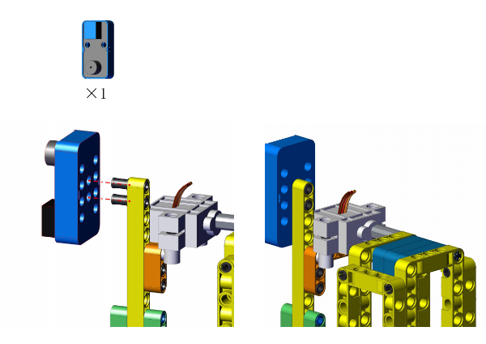


**Step 12**

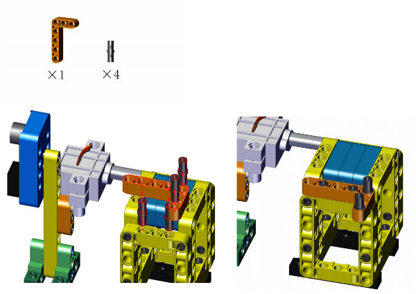


**Step 13**


**Step 14**


**Completed!**


#### Wiring Diagram


#### Test Code

Open 4.5Smart bin_Automatic mode.py and click .

```python
'''
 * Filename    : Smart bin_Automatic mode
 * Thonny      : Thonny 4.1.4
 * Auther      : http//www.keyestudio.com
'''
from machine import Pin,PWM
import time

servo = PWM(Pin(19))
servo.freq(50)  #T = 1/f = 20ms

def angle(x):
    return int((((x + 45) * 1.8 / 270) + 0.6 )/ 20 *65535)


Obsensor = Pin(22,Pin.IN)
Buzzer = Pin(2,Pin.OUT)

while True:
    Obsensor.value()
    if Obsensor.value() == 0: #detects something
        Buzzer.on()           #buzzer alarms
        servo.duty_u16(angle(-45))  #lid opens
    else:                     #detects nothing
        Buzzer.off()          #buzzer stays quiet
        servo.duty_u16(angle(90))  #lid closes
    time.sleep(0.5)
```

#### Explanation


**Conceive:**

1. Initialization: set the pins of obstacle avoidance sensor, buzzer and servo, set the servo output frequency.

2. Loop:

   ① Read the digital power level of obstacle avoidance sensor.

   ② Determine whether the read value equals 0.

   - If it is 0, i.e., the sensor detects obstacles, the buzzer will emit sound. At this time, the servo rotates to open the lid.
   - If it is not 0, i.e., there is no obstacle, the buzzer will not alarm and the servo rotates to close the lid.


#### Test Result


After uploading code, we first need to adjust the obstacle avoidance sensor (please see chapter 3.5 for details).

After adjusting, place something in the sensing range in front of the obstacle avoidance sensor.

When the obstacle avoidance sensor detects it, the buzzer makes a sound, and the servo rotates to open the lid; When the thing leaves the sensing range, the sensor detects nothing, and the buzzer stops alarming, and the servo rotates to close the lid.


---

### 4.6 Smart Trash Can (Drop Alarm)

In this experiment, we will add a drop alarm system to the trash can with an SC7A20TR three-axis acceleration sensor and an active buzzer.

#### Flow


#### Assembly


**Required:**


The block appearance is similar to that in chapter 4.4 and 4.5. If you've already built one of them, you don't have to dismantle it all and reassemble it, just follow these steps.

**The blocks in 4.4:**

① Remove the servo and the lid

② Assemble from step 4

**The blocks in 4.5**

① Remove the servo and the lid

② Assemble from step 5

Yet if <span style="color: rgb(10, 10, 200);">you have not assemble the building blocks</span>, please start from step 1.


**Step 1**


**Step 2**


**Step 3**


**Step 4**


**Step 5**


**Step 6**


**Step 7**


**Completed!**


#### Wiring Diagram


#### Test Code

Open 4.6Smart bin_Drop alarm.py and click .

```python
'''
 * Filename    : Smart bin_Drop alarm
 * Thonny      : Thonny 4.1.4
 * Auther      : http//www.keyestudio.com
'''
from machine import Pin
from SC7A20 import sc7a20
import time

Buzzer = Pin(2,Pin.OUT)
scl = Pin(5) 
sda = Pin(4)
bus = 0
Triaxial = sc7a20(bus, scl, sda)
while True:
    tumble_count = Triaxial.tumble_handle()
    if tumble_count >= 3:  #Overturn the trash can.
        Buzzer.on()        #The buzzer alarms.
    else:                  #Place trash can flatwise.
        Buzzer.off()       #The buzzer stops emitting sounds.
    time.sleep(0.01)
```

#### Explanation


**Conceive:**

1. Initialization: set the pins of IIC and the active buzzer.

2. Loop:

   Determine whether the trash can is in a horizontal position.

   - If no, the buzzer alarms.
   
   - If yes, the buzzer stays quiet.
   


#### Test Result


Place the trash can flatwise.

Upload code and tilt the trash can, the buzzer will alarm.


Straighten it, and the buzzer stops alarming.

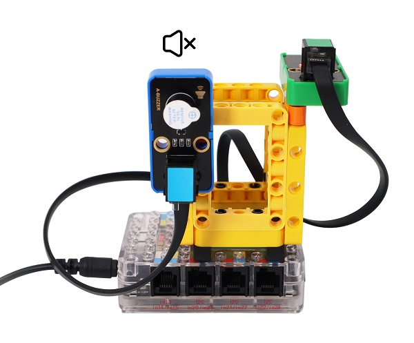


