# Smart Binsite Kit

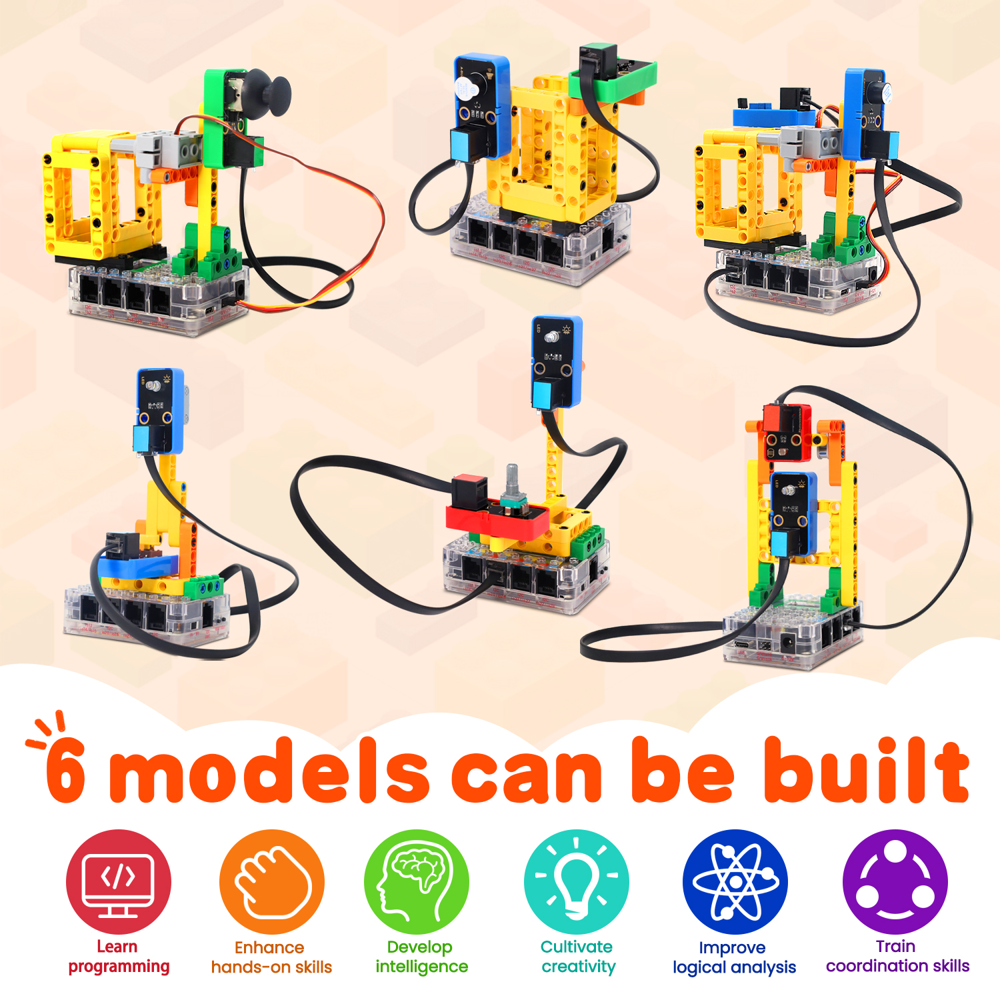

## Introduction

Based on KidsBlock and python programming language, the Smart Binsite Kit is designed for children aged 9-12 years old, which can be adapted to Legos and three types of mainboards: kidsUNO, kidsIOT and kidspico.

KidsBlock integrates building blocks to program by combining code blocks, so you do not have to learn complex programming syntax. You may learn programming much easier!

Python programming language is with simplicity and concise syntax, so it is easy to learn and suitable for beginners. You may master a systematic programming knowledge step by step!

In this kit, multiple sensors and modules are included: white LED module, 3V relay module, button module, active buzzer, obstacle avoidance sensor, photoresistor, potentiometer, joystick module, SC7A20 three-axis acceleration sensor and servo. Besides, it can transforms into six appearances with building blocks: manual lighting, automatic lighting, light adjustment, smart trash can(manual mode), smart trash can(automatic mode), smart trash can(drop alarm). The building blocks are provided, so you may design forms at will, which greatly improves logical analysis, creativity, hands-on skills and problem-solving ability.

---

## Kit List

**Mainboards are NOT included in this kit.**

|  #   |                     NAME                     |               PIC               | QTY  |
| :--: | :------------------------------------------: | :-----------------------------: | :--: |
|  1   |               White LED module               |   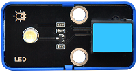   |  1   |
|  2   |                Active buzzer                 |   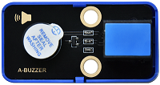   |  1   |
|  3   |                Button module                 |   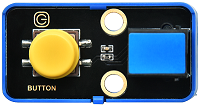   |  1   |
|  4   |               3V relay module                |   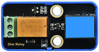   |  1   |
|  5   |          Obstacle avoidance sensor           |   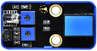   |  1   |
|  6   |               Joystick module                |   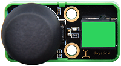   |  1   |
|  7   |                Potentiometer                 |   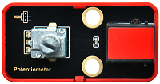   |  1   |
|  8   |                Photoresistor                 |   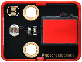   |  1   |
|  9   |   SC7A20TR three-axis acceleration sensor    |   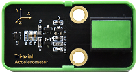   |  1   |
|  10  | 270° Servo (compatible with building blocks) |  |  1   |
|  11  |                Telephone wire                |     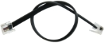     |  5   |
|  12  |                Building block                |    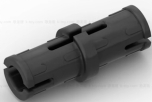     |  22  |
|  13  |                Building block                |    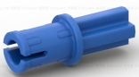     |  4   |
|  14  |                Building block                |    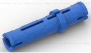     |  6   |
|  15  |                Building block                |    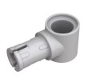     |  2   |
|  16  |                Building block                |    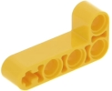     |  3   |
|  17  |                Building block                |    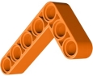     |  2   |
|  18  |                Building block                |    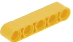     |  2   |
|  19  |                Building block                |    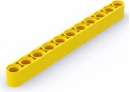     |  2   |
|  20  |                Building block                |    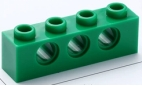     |  2   |
|  21  |                Building block                |    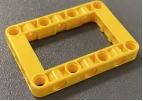     |  4   |
|  22  |                Building block                |    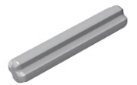     |  2   |
|  23  |                Building block                |    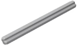     |  1   |
|  24  |                Building block                |    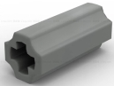     |  1   |
|  25  |                Building block                |    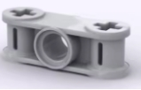     |  2   |
|  26  |                Building block                |    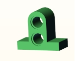     |  2   |
|  27  |                Building block                |    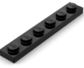     |  4   |
|  28  |            Flat-head screwdriver             |     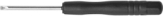      |  1   |

---

## Mainboards

**Mainboards are NOT included in this kit.**

**Before experiments, please have a good grasp of main boards:**

[kidsuno](https://wiki.kidsbits.cc/projects/KD2075/en/latest/)

[kidsIOT](https://wiki.kidsbits.cc/projects/KD2076/en/latest/)

[kidspico](https://wiki.kidsbits.cc/projects/KD2077/en/latest/)

**On-board OLED Display Tutorials:**

[kidsuno_OLED](https://wiki.kidsbits.cc/projects/KD2075/en/latest/docs/kidsUno.html#oled-display)

[kidsIOT_OLED](https://wiki.kidsbits.cc/projects/KD2076/en/latest/docs/kidsIOT.html#id1)

[kidspico_OLED]( https://wiki.kidsbits.cc/projects/KD2077/en/latest/docs/KidsPico.html#id2)
